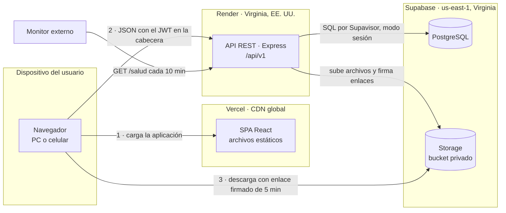
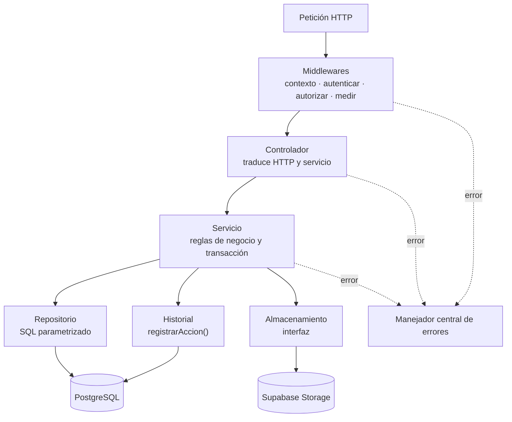
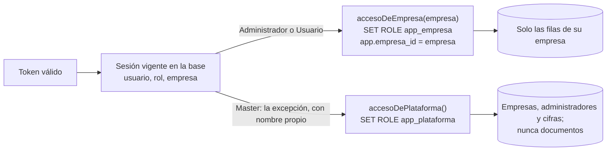
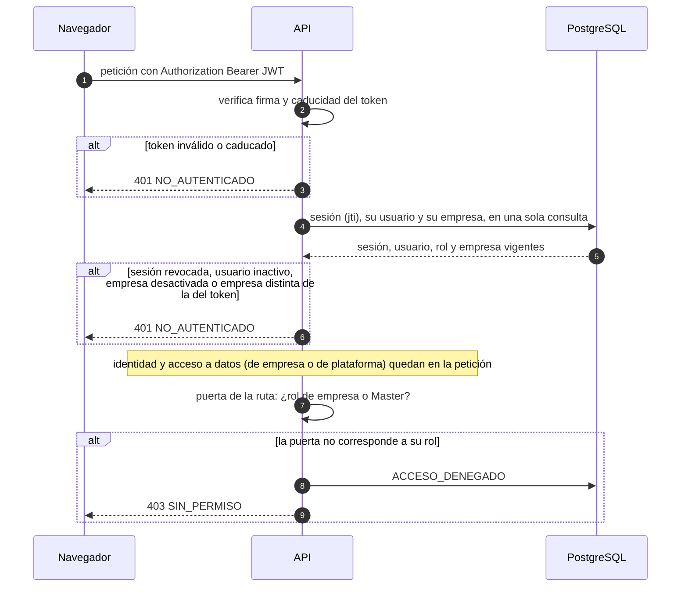
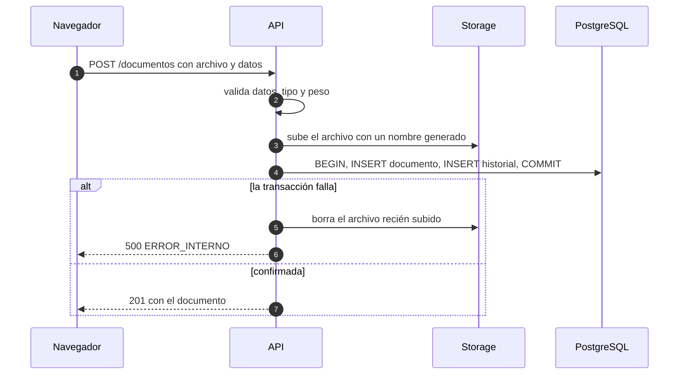
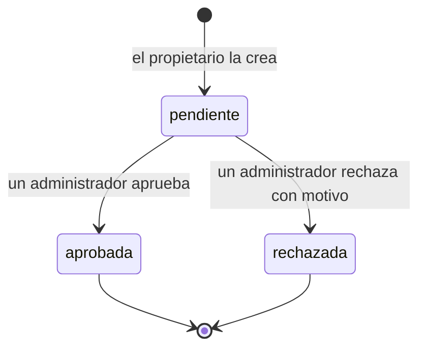

# 02 · Arquitectura

## 1. Vista general

Todo viaja por HTTPS o TLS. El navegador nunca habla con la base de datos, y con Storage solo para
descargar un archivo con un enlace que la API firmó después de autorizar y registrar.

## 2. Estilo: tres capas, un monolito modular

| Capa | Pieza | Responsabilidad |
|---|---|---|
| Presentación | SPA React | Pantallas, navegación y formularios. No decide permisos: oculta lo que la API dice que no se puede hacer |
| Aplicación | API Express | Autenticación, autorización, reglas de negocio, transacciones e historial |
| Datos | PostgreSQL y Storage | Persistencia, integridad (claves foráneas y restricciones) y archivos |

Un solo servicio de backend, organizado en módulos: auth, usuarios, categorías, documentos,
solicitudes, notificaciones e historial. Los microservicios están fuera del alcance, y para siete
módulos y cinco usuarios solo añadirían red y despliegues.

## 3. Dentro de la API

- **Middlewares.** `contexto` asigna un id a la petición y deduce si viene de un móvil; `autenticar`
  resuelve la sesión y crea el **acceso a datos** de la petición (§3.1); `autorizar` exige el permiso
  y, si falla, responde 403 y registra `ACCESO_DENEGADO`. Toda ruta entra por una de dos puertas: la
  de empresa (sesión y un rol de empresa) o la de plataforma (sesión y rol Master).
- **Controlador.** Valida la entrada con el esquema Zod del endpoint, llama al servicio y elige el
  código de estado. Ni SQL ni reglas. Por qué la validación vive aquí y no en un middleware:
  [Estructura §6](05-estructura.md).
- **Servicio.** Las reglas de negocio y la transacción. No conoce Express —no recibe `req` ni
  `res`—, así que se prueba sin levantar un servidor.
- **Repositorio.** SQL parametrizado y la traducción entre `snake_case` y `camelCase`. Ninguna regla.
  Sus consultas filtran por la empresa del actor, y debajo la base vuelve a filtrar (§3.1).
- **Historial.** `registrarAccion()` recibe la conexión de la transacción en curso: el registro y la
  operación se confirman o se deshacen juntos.
- **Errores.** Todos acaban en un único manejador, que produce el formato descrito en la [API](04-api.md).

### 3.1 La capa de acceso a datos: el aislamiento entre empresas (D17)

Ningún servicio de negocio recibe el pool de conexiones. Recibe, dentro del `Actor`, un acceso a
datos que creó la autenticación a partir de la identidad guardada en la base, nunca de lo que envía el
cliente. Cada operación corre en una transacción que primero adopta un rol de PostgreSQL sin
privilegios y fija la empresa activa; las políticas RLS hacen el resto.

Son tres capas, y cada una basta por sí sola para que una consulta no devuelva nada ajeno: el
repositorio filtra por `empresa_id`; si una consulta lo olvidara, RLS no devuelve filas de otra
empresa; y las claves foráneas compuestas (M2) impiden que una fila apunte a otra empresa. Si la
transacción no fija empresa, `app_empresa` no ve nada: el fallo es cerrado. Desde la auditoría, la
transacción fija también quién actúa y con qué rol, y con eso la base aplica los permisos por categoría
(D22). La identidad (iniciar sesión, comprobar la sesión, recuperar la contraseña, el script del Master)
es la otra excepción explícita: averigua quién es alguien antes de saber su empresa, y por eso usa la
conexión dueña de las tablas, limitada a cuentas, sesiones y recuperaciones. Los respaldos (D25) son la
tercera, y nunca salen por la API.

## 4. Flujos críticos

### 4.1 Autenticación en cada petición

El token lleva la empresa y el rol (decisión C), pero el rol y la empresa que valen son los de la
base: un cambio de rol, una desactivación o la desactivación de la empresa valen desde la petición
siguiente. Si la empresa del token no coincide con la de la base, el token no es de fiar y se rechaza.

### 4.2 Subir un documento

El archivo se sube **antes** de la transacción. Al revés, un fallo de Storage después de confirmar
dejaría un documento que apunta a un archivo inexistente. Así, lo peor que puede pasar es un archivo
huérfano que nada referencia, y aun así se intenta borrar.

### 4.3 Ver o descargar

El enlace se firma antes de registrar y se entrega después: si el registro falla, el enlace existe,
pero nadie lo recibe.

### 4.4 Ciclo de una solicitud de aprobación

Cada transición es una transacción: el cambio de estado, su registro en el historial y las
notificaciones. La resolución solo se aplica si la solicitud sigue pendiente; si dos administradores
resuelven a la vez, el segundo recibe 409 `SOLICITUD_RESUELTA`.

## 5. Despliegue

| Pieza | Servicio y plan | Región | Límites que condicionan el diseño |
|---|---|---|---|
| SPA | Vercel, Hobby | CDN global | Solo uso no comercial |
| API | Render, web service Free | Virginia | 512 MB de RAM y 0,1 CPU; se duerme tras 15 min sin tráfico y tarda alrededor de un minuto en despertar; 750 h al mes; 5 GB de salida al mes; disco efímero; puertos SMTP bloqueados |
| Base de datos | Supabase, Free | us-east-1 | 500 MB; se pausa tras 7 días sin actividad; sin copias de seguridad propias (de ahí D25) |
| Archivos | Supabase Storage, Free | us-east-1 | 1 GB entre los dos buckets privados, `documentos` y `respaldos`; 50 MB por archivo (usamos 10); 5 GB de salida al mes |
| Monitor | `pg_cron` + `pg_net` en Supabase (D13); UptimeRobot, opcional | — | — |
| Integración continua | GitHub Actions (D26) | — | 2.000 minutos al mes en un repositorio privado del plan gratuito |

**Entornos.** Desarrollo: API y frontend en local, contra un proyecto de Supabase «desarrollo».
Producción: Render y Vercel, contra un proyecto «producción». Son los dos proyectos activos que
permite el plan gratuito, y mantienen los datos de la evaluación lejos de las pruebas.

**Sin tarjeta registrada** en ningún proveedor: si se supera un límite, el servicio se restringe o
se suspende en vez de cobrar.

## 6. Seguridad

| Amenaza | Control |
|---|---|
| Robo de la base de datos | Contraseñas con bcrypt (coste 10); nunca en claro, tampoco en el historial |
| Fuerza bruta contra el inicio de sesión | Límite de intentos fallidos por IP (RN20) y bloqueo por correo tras cinco contraseñas incorrectas, exista o no la cuenta (RN27); el mismo mensaje, y el mismo tiempo de respuesta, para un correo inexistente que para una contraseña errónea |
| Robo del token | Caduca en 8 h y se puede revocar; contra XSS, el escapado de React y una CSP estricta en Vercel |
| Escalada de privilegios | Rol leído de la base en cada petición; matriz aplicada solo en la API; cada 403 queda registrado; el rol `master` no se puede asignar desde la API y la base admite un solo Master |
| Un empleado leyendo lo confidencial de su propia empresa | Categorías restringidas: la base decide con RLS quién ve una categoría y sus documentos, también en la búsqueda, la ficha, el archivo y la subida (D22) |
| Borrado accidental o malintencionado | Papelera de 30 días con restauración (D23); respaldo nocturno de la base con restauración probada (D25) |
| Acceso a datos de otra empresa | Empresa tomada de la identidad, nunca del cliente; capa de acceso transversal con RLS (D17); claves foráneas compuestas (M2); UUID imposibles de adivinar; lo ajeno responde 404; batería de pruebas A contra B en cada endpoint |
| Un token con otra empresa, aun firmado con el secreto | La empresa del token se compara con la de la base: si no coinciden, 401 |
| El Master leyendo el contenido de una empresa | Su rol de base (`app_plataforma`) no tiene permisos sobre documentos, solicitudes, notificaciones ni tiempos de respuesta; sus cifras salen de una función que solo devuelve conteos (decisión E); del historial solo lee sus propias acciones y lo que no es de ninguna empresa (D24); los respaldos no se descargan por la API (D25) |
| Recuperación de contraseña como oráculo de cuentas o puerta trasera | Misma respuesta y mismo tiempo exista o no el correo; token de 256 bits, de un solo uso, 60 minutos, guardado como huella SHA-256 y enviado en el fragmento del enlace; límite de peticiones por IP |
| Inyección SQL | Solo consultas parametrizadas |
| Archivo malicioso | Lista blanca de tipos, 10 MB, nombre generado por el servidor, bucket privado y servido desde el dominio de Supabase, no desde el de la aplicación. El logo de una empresa, además, solo PNG o JPG (un SVG puede llevar scripts) de hasta 256 KB, comprobado por su contenido, y la CSP solo admite imágenes de ese dominio (D28) |
| Un empleado cambiando la identidad de su empresa, o una empresa la de otra | La API exige ser administrador, y la base también: el rol de empresa solo puede actualizar esas tres columnas de su propia fila y solo si quien actúa es administrador (migración 008); el logo debe estar en la carpeta de su empresa (D28) |
| Lectura de tablas por la API automática de Supabase | Data API desactivada; RLS activo en todas las tablas, con políticas solo para los roles propios de la API (D14, D17); y la migración 002 quita a `anon` y `authenticated` los permisos que Supabase les concede por defecto, también sobre las funciones, que RLS no cubre; la 003 quita a todos la ejecución directa de los triggers y fija el `search_path` de cada función |
| Secretos en el repositorio | Variables de entorno; `.env` ignorado por git; la clave secreta de Supabase y la de Brevo solo existen en Render; los datos del Master solo en el `.env` de quien ejecuta el script |
| Manipulación del historial | Solo inserción, impuesto por un trigger (M4) |
| Errores que revelan el interior | Manejador central: en producción, un 500 no lleva trazas ni SQL |
| Peticiones desde otros sitios | CORS solo admite el origen del frontend |

## 7. Decisiones técnicas

Cada una dice qué se decidió, por qué y qué se descartó. Las decisiones de datos están en el
[modelo de datos](03-modelo-datos.md) (M1–M10) y las de código, en la [estructura](05-estructura.md) (E1–E7).

### Las preguntas del jurado

**D1 · Una API propia entre el navegador y los datos.** Toda lectura y escritura pasa por Express. Es
la única forma de garantizar que cada acción quede en el historial dentro de su misma transacción
—lecturas incluidas: búsquedas y descargas— y de tener las reglas de negocio en un solo sitio.
*Descartado:* usar Supabase como backend completo (su Auth y su API automática con RLS) llamado desde
React. El navegador escribiría directamente y el registro dependería del cliente: un corte de red a
mitad de camino, y el indicador 4 pierde una acción.

**D2 · PostgreSQL.** Los datos son relacionales por naturaleza —empresas, usuarios, documentos,
solicitudes— y la integridad se puede exigir en la propia base: claves foráneas, restricciones,
índices únicos parciales y transacciones. Los indicadores, además, se calculan con SQL estándar.
*Descartado:* una base documental (MongoDB, Firestore). Sin claves foráneas, la coherencia entre
documento, solicitud e historial dependería solo del código.

**D3 · React, como SPA.** Una aplicación que vive detrás de un inicio de sesión no gana nada con el
renderizado en servidor: compilada a archivos estáticos, se sirve gratis desde una CDN y solo habla
con la API. React aporta componentes reutilizables y el ecosistema más amplio.
*Descartado:* Next.js (el renderizado en servidor no aporta detrás de un login y complica el
despliegue) y Angular (más estructura de la que piden una decena de pantallas).

**D4 · JWT, pero revocable.** El token, firmado con HS256 y válido 8 horas, lleva el id del
usuario, el de su sesión (`jti`) y, desde la v2, su empresa y su rol (decisión C). En cada petición la API comprueba esa sesión y al usuario en la
base, con una consulta que haría falta de todos modos para leer el rol vigente. Así, cerrar sesión,
desactivar a alguien o cambiarle el rol surte efecto al instante; la firma, por su parte, rechaza un
token manipulado o caducado sin tocar la base.
*Descartado:* JWT sin estado. Un usuario desactivado seguiría entrando hasta que caducara su token, y
eso es exactamente un acceso incorrecto para el indicador 6.

### Sesión, permisos y empresas

**D5 · El token viaja en la cabecera Authorization, no en una cookie.** El frontend (`vercel.app`) y
la API (`onrender.com`) están en dominios distintos, así que una cookie de sesión sería de terceros,
y Safari —el navegador del iPhone— las bloquea por defecto: iniciar sesión desde un iPhone fallaría,
y eso es el indicador 5.
*Descartado:* cookie httpOnly, que exige poner ambos bajo un dominio propio (cuesta dinero). El
riesgo que se acepta —un token en `localStorage` es legible si hubiera XSS— se acota con el escapado
de React, una CSP estricta y la caducidad de 8 horas.

**D6 · Una plataforma multiempresa por columna compartida (v2).** Todas las empresas viven en la
misma base y las mismas tablas; cada fila de negocio lleva `empresa_id`. Hay un Administrador Master
que da de alta las empresas con su primer administrador (no hay registro público, decisión B) y que no
pertenece a ninguna. Permite evaluar con personas de varias MYPEs sin mezclar sus documentos y sin un
despliegue por empresa.
*Descartado:* un esquema o una base por empresa (las migraciones se multiplican, y el plan gratuito
limita conexiones y proyectos) y una instalación por empresa. La v1 tenía ya la «organización» como
entidad; la v2 la renombra a empresa y añade el Master ([06-migracion-v2.md](06-migracion-v2.md)).

**D7 · El historial se escribe en la misma transacción que la acción.** Cada servicio abre una
transacción, ejecuta la operación y llama a `registrarAccion()` con la misma conexión: se confirman
las dos cosas o ninguna.
*Descartado:* triggers de auditoría. No ven las lecturas (búsquedas, descargas), no saben qué usuario
de la aplicación actuó y son más difíciles de probar. Sí se usa un trigger, pero solo para impedir que
el historial se modifique (M4).

**D8 · El frontend oculta; la API decide.** La interfaz esconde lo que el rol no permite, pero no
bloquea rutas por rol: si un usuario teclea `/admin/usuarios`, la página pide los datos, la API
responde 403 y lo registra. Si el bloqueo ocurriera en el navegador, ese intento no llegaría al
servidor y el indicador 6 no lo vería. Para no duplicar la matriz de permisos en el frontend, la API
devuelve con cada documento qué puede hacer con él quien lo consulta.
*Descartado:* guardas de ruta por rol en React: una segunda copia de la matriz, que tarde o temprano
diverge de la primera.

### Archivos

**D9 · Archivos en Supabase Storage, servidos con enlace firmado.** Bucket privado: la API firma un
enlace de 5 minutos después de autorizar y registrar, y el navegador descarga directamente de
Supabase. Mismo proveedor que la base, 1 GB gratis y sin tarjeta. Además, las descargas no
atraviesan Render, cuyo plan gratuito tiene 0,1 CPU y 5 GB de salida al mes.
*Descartado:* el disco de Render (se borra en cada reinicio), Amazon S3 (pide tarjeta y cobra al
salir de la capa gratuita) y Cloudinary (pensado para imágenes).

**D10 · La subida pasa por la API.** La validación (tipo y peso) y el registro ocurren en un solo
punto, y con un tope de 10 MB el archivo cabe en memoria.
*Descartado:* la subida directa del navegador a Storage con un enlace firmado de subida. Ahorraría
tráfico en Render, pero son dos pasos, deja archivos huérfanos si el segundo falla y el registro
dependería de que el navegador complete el proceso. Si el volumen creciera, sería el cambio natural.

### Infraestructura

**D11 · API y base de datos en la misma región: Virginia, EE. UU.** Cada petición hace varias
consultas; con la API y la base en regiones distintas, cada consulta pagaría el viaje de ida y vuelta.
Juntas, el único tramo largo es navegador → API, una vez por petición. Render no tiene región en
Sudamérica, así que la base va a us-east-1 aunque Supabase ofrezca São Paulo.
*Descartado:* Supabase en São Paulo con la API en Virginia.

**D12 · Conexión por Supavisor en modo sesión.** La conexión directa de Supabase solo funciona por
IPv6, y Render solo sale por IPv4: sin esto, la API no conecta (`ENETUNREACH`). El pooler en modo
sesión usa IPv4 y se comporta como una conexión normal, transacciones incluidas.
*Descartado:* el complemento IPv4 de Supabase, que es de pago.

**D13 · Un monitor mantiene despierta la API.** Render gratuito duerme la API tras 15 minutos
sin tráfico y tarda alrededor de un minuto en despertarla: la primera persona de cada sesión de
evaluación esperaría un minuto (indicador 7) o vería un error (indicador 5). Un trabajo de `pg_cron`
en Supabase llama a `/salud` cada 10 minutos con `pg_net`, y las 750 horas mensuales de Render cubren
una instancia encendida todo el mes, siempre que sea la única gratuita del workspace. Como `/salud`
consulta la base desde Render, mantiene activo también el proyecto de Supabase, que se pausa tras 7 días
sin actividad. No pide ninguna cuenta más; un monitor externo (UptimeRobot) puede sumarse para tener un
registro de caídas como evidencia de disponibilidad, que el de Supabase no da porque vive dentro del
sistema que vigila.
*Descartado:* un plan de pago de Render, «abrir la página un rato antes», que depende de acordarse, y
depender solo de un monitor externo, que exige una cuenta y una configuración más.

**D14 · Supabase se usa como PostgreSQL y almacén, nada más.** Ni Supabase Auth, ni su API automática,
ni Realtime. Se desactiva la Data API y, por si se reactivara, RLS está activo en cada tabla con
políticas solo para los roles propios de la API (`app_empresa`, `app_plataforma`), de modo que nadie
pueda leerlas por esa vía. RLS no protege las funciones: la migración 002 quita a los roles de esa API
(`anon`, `authenticated`) lo que Supabase les concede por defecto, de modo que tampoco puedan llamar a
las funciones de plataforma. De paso, la base es PostgreSQL estándar: cambiar de proveedor es cambiar una
cadena de conexión.

**D15 · Notificaciones dentro del sistema.** Una tabla que la interfaz consulta al navegar y al
volver a la pestaña. El único correo que envía el sistema es el de recuperación de contraseña (D19).
*Descartado:* avisar de las solicitudes por correo (más envíos de los que caben en la capa gratuita y
más datos personales circulando) y las notificaciones push o por websockets, fuera del alcance.

**D16 · En desarrollo y en las pruebas, los archivos van a una carpeta local.** Una segunda
implementación del almacenamiento imita a Supabase: la API firma un enlace con caducidad (HMAC) y una
ruta propia sirve el archivo solo si la firma y el plazo son válidos. Así el sistema completo funciona
en una sola máquina, sin cuentas, y las pruebas suben y descargan archivos de verdad en vez de usar un
doble. En producción el arranque lo impide: el disco de Render se borra en cada reinicio.
*Descartado:* depender de un proyecto de Supabase para desarrollar (lento, con datos compartidos, y
gasta uno de los dos proyectos gratuitos) y un doble en memoria (no habría probado la firma de enlaces).

### Multiempresa (v2)

**D17 · El aislamiento vive en una capa transversal y, debajo, en la propia base.** Los servicios no
reciben el pool, sino un acceso a datos creado por la autenticación (§3.1). Cada transacción adopta
`app_empresa` con la empresa de la identidad, o `app_plataforma` para el Master; RLS filtra todas las
tablas de negocio. Así el aislamiento no depende de que cada consulta se acuerde del `WHERE`: una
consulta que lo olvide sigue sin ver nada ajeno. Los roles se adoptan con `set_config('role', …, true)`
dentro de la transacción, que funciona igual a través de Supavisor (D12) y deja la conexión limpia al
terminar.
*Descartado:* filtrar solo en el código (un olvido es una fuga), una conexión por rol con su propia
contraseña (más secretos y más conexiones, que Supavisor limita) y RLS con las variables de Supabase
Auth (no se usa su Auth, D14).

**D18 · El Master es una excepción explícita, con su propia puerta.** Su acceso se decide en un solo
sitio (`accesoDe`), sus rutas cuelgan de `/plataforma` y su rol de base solo alcanza empresas,
administradores y dos funciones: las cifras por empresa (solo conteos) y revocar las sesiones de una
empresa al desactivarla. Su cuenta es única, la crea un script con datos del entorno y su contraseña
tiene reglas propias (RN22, RN23). Lo que hace con una empresa queda en el historial de esa empresa.
*Descartado:* un Master que «ve todo» (sería el atajo para leer documentos ajenos, y la decisión E lo
excluye) y crearlo desde la interfaz.

**D19 · El correo sale por la API HTTPS de Brevo.** Render gratuito bloquea SMTP, y Brevo permite
enviar 300 correos al día desde un remitente verificado sin dominio propio. Detrás de una interfaz
`Correo`, como el almacenamiento: en desarrollo y en las pruebas los correos se guardan en una carpeta
(el enlace sale por la consola), y en producción el arranque exige Brevo.
*Descartado:* Resend (exige un dominio propio para escribir a terceros), SMTP de Gmail (bloqueado en
Render y frágil) y Supabase Auth solo para el correo (obligaría a duplicar las cuentas).

**D20 · Recuperación de contraseña con un enlace de un solo uso.** Un token aleatorio de 256 bits que
viaja en el fragmento del enlace (`/restablecer-clave#…`), que el navegador no envía a ningún servidor;
en la base solo queda su huella SHA-256, con 60 minutos de vigencia contados por el reloj de la base.
Gastarlo es una sola sentencia (dos peticiones a la vez no lo usan dos veces), pedir otro anula el
anterior, y definir la contraseña cierra todas las sesiones. La respuesta a la petición es la misma
exista o no el correo, y el correo se envía sin esperarlo para que tampoco el tiempo lo delate.
*Descartado:* códigos de 6 dígitos (adivinables con pocos intentos) y guardar el token en claro.

### Despliegue

**D21 · La API entra a la base con un usuario propio, `gestion_api`.** Es dueño del esquema y puede
crear los dos roles de D17, pero no es superusuario ni salta RLS; se crea una vez por SQL con su
contraseña ya cifrada (SCRAM), de modo que la contraseña en claro no pasa por la consola de Supabase
ni por sus registros. Así la cadena de conexión de Render no abre la base entera, y lo que crea la API
no hereda los permisos que Supabase concede por defecto a `anon` y `authenticated` sobre lo que crea
`postgres`.
*Descartado:* conectar como `postgres`, con más privilegios de los que la API necesita y cuya
contraseña Supabase solo deja cambiar desde su panel.

### Tras la auditoría técnica (A)

**D22 · Los permisos por categoría también los decide la base.** Cada transacción fija, además de la
empresa, quién actúa y con qué rol (`app.usuario_id`, `app.rol`); una política RLS restrictiva sobre
`categorias` y `documentos` llama a `puede_ver_categoria()`, que deja pasar a los administradores y,
en una categoría restringida, solo a las personas de `categoria_accesos`. Así la búsqueda, la ficha, el
enlace al archivo y la subida obedecen sin que ningún servicio lo compruebe a mano, igual que el
aislamiento entre empresas (D17). Sin persona fijada no se abre nada restringido: falla cerrado.
*Descartado:* comprobarlo en cada servicio (un olvido sería una fuga dentro de la empresa) y permisos
por documento (una MYPE piensa en carpetas, no en archivos sueltos, y multiplicaría la configuración).

**D23 · Papelera de 30 días y purga que deja constancia.** Eliminar sigue siendo lógico; ahora se
guarda quién lo hizo, un administrador puede restaurar, y una tarea de la API purga lo vencido cada seis
horas, empresa por empresa y a través del mismo acceso con RLS. Purgar borra el archivo antes de marcar
la fila (`purgado_en`), en una transacción por documento: si falla a medias, la siguiente pasada lo
repara. La fila no se borra porque el historial y las solicitudes la nombran.
*Descartado:* borrar la fila (rompería la trazabilidad del indicador 4), no purgar nunca (el
almacenamiento gratuito es de 1 GB) y un cron externo (otra pieza que vigilar; la API ya está despierta
por D13).

**D24 · La auditoría del Master lee solo lo que es de la plataforma.** Una política RLS le deja leer
del historial sus propias acciones —también las que hizo sobre una empresa— y los asientos sin empresa,
como los intentos con correos desconocidos; la consulta repite esa condición por escrito. Para la
supervisión de seguridad basta, y la actividad de las personas de cada empresa sigue siendo solo suya
(D18).
*Descartado:* darle el historial completo (leería qué documentos busca y abre cada empresa, que es leer
su contenido por la puerta de atrás).

**D25 · Respaldo lógico nocturno, en un bucket privado propio.** El plan gratuito de Supabase no tiene
copias de seguridad, y el historial es la evidencia del capítulo 3 (R3). A las 03:00 de Lima la API lee
todas las tablas de negocio en una transacción de solo lectura (`row_to_json`), las comprime y las
guarda en el bucket `respaldos`; conserva 30 días. Restaurar (`npm run respaldo -- restaurar`) vuelca
el respaldo con `json_populate_recordset` en una base vacía con las mismas migraciones, todo o nada; una
prueba de ida y vuelta compara las dos bases tabla por tabla. Leer y escribir todas las empresas exige
la conexión dueña de las tablas: es otra excepción explícita, como la capa de identidad, y por eso el
respaldo nunca sale por la API. El Master ve que existen y pide uno, sin descargarlo.
*Descartado:* `pg_dump` (no está en Render y pide credenciales de superusuario), el plan Pro de Supabase
(de pago) y depender solo de exportar el CSV a mano.

**D26 · Integración continua sin despliegue.** GitHub Actions ejecuta en cada push a `main` y en cada
pull request las pruebas del backend (con PostgreSQL 17), las del frontend con su compilación y las
funcionales con Playwright, y guarda el informe como artefacto. Render y Vercel siguen desplegando desde
`main` por su cuenta.
*Descartado:* un pipeline que también despliegue (es el «CI/CD complejo» que CLAUDE.md deja fuera) y no
tener ninguno (las pruebas dependerían de acordarse de ejecutarlas).

**D27 · La actividad de un documento sale del historial, según quién mira.** La ficha muestra la línea de
tiempo del documento (RF30): sus asientos y los de sus solicitudes, sin tablas ni registros nuevos. Todos
ven su ciclo de vida; quien puede consultar el historial ve además quién lo vio y lo descargó. Solo se
entrega de un documento que el actor ve, así que respeta el aislamiento y las categorías restringidas
sin reglas nuevas. Para que las tablas que vengan (versiones, identidad) no lleguen sin su política, una
prueba recorre el catálogo y exige RLS y la política de aislamiento en toda tabla con `empresa_id`.
*Descartado:* una tabla de eventos propia (duplicaría el historial) y mostrar todo a todos (la ficha se
volvería una vigilancia entre compañeros: quién abrió qué y cuándo).

**D28 · Identidad por empresa reducida y tema por persona, sobre variables de CSS.** Cada empresa puede
tener un nombre comercial, un color y un logo (RF31); cada persona, su tema (RF32). Tailwind compila cada
color a una variable de CSS, así que un solo color (`--marca`) da todos los tonos con `color-mix`, y el
modo oscuro redefine las variables bajo `<html data-tema="oscuro">`: ningún componente cambió de clases y
las pantallas futuras heredan los dos sin trabajo. Como el color decide la legibilidad de botones y
enlaces, la API solo acepta los que alcanzan 4,5:1 con el texto blanco (WCAG 2.1 AA); los tonos del modo
oscuro se mezclan con blanco y superan 6:1 sobre su fondo con cualquier color aceptado (comprobado con
diez colores, desde el negro hasta los más claros que se aceptan). El logo vive en el almacenamiento
privado, en la carpeta de la empresa, y llega con un enlace firmado que dura lo que la sesión. La
identidad la cambia el administrador, y también la base lo exige (migración 008); queda en el historial
como `EMPRESA_EDITADA`. El tema se guarda en la cuenta, no en el navegador, para que siga a la persona
del celular al ordenador; no se audita porque no toca datos.
*Descartado:* un bucket público para los logos (sería la única puerta pública del almacenamiento),
admitir SVG (puede llevar scripts), una paleta completa o un segundo color por empresa (más campos que
validar sin valor para la tesis), y guardar el tema solo en el navegador (se perdería al cambiar de
dispositivo, y la evaluación usa celular y ordenador).

**D29 · Vista previa con el enlace de «Ver» y el visor del navegador.** La ficha muestra el archivo dentro
de la página (RF33): pide el mismo enlace firmado de «Ver», así que queda registrada igual
(`DOCUMENTO_VISUALIZADO`, indicador 3), y abrir la ficha sigue sin contar. Las imágenes van en un ``;
un PDF, en un marco con el visor del propio navegador, solo si lo tiene (`navigator.pdfViewerEnabled`:
Chrome en Android no, y ahí sigue «Ver»). El marco no va aislado (`sandbox`), porque el visor de PDF no
funciona en uno aislado; el archivo viene del dominio de Supabase, no del de la aplicación, así que no
puede tocar la página. La CSP admite marcos solo de ese dominio. Word y Excel no se previsualizan.
*Descartado:* pdf.js (más de 1 MB para lo que el navegador ya hace), un visor de Office en línea (enviaría
los documentos a un tercero) y pasar el archivo por la API (los archivos no salen por Render, R5).

**D30 · Versiones que se suman y nunca se reescriben.** Una tabla `documento_versiones` guarda cada
versión (RF34) con su archivo, su autor, su fecha y un comentario; el documento conserva sus columnas de
archivo como la vigente, así que el listado, la búsqueda, la ficha y la descarga no cambiaron. La 009 creó la
versión 1 de cada documento existente. La tabla tiene la política de aislamiento de siempre y una
restrictiva que exige que el documento sea visible para quien pregunta: la subconsulta pasa por la RLS de
`documentos`, así que una categoría restringida oculta también sus versiones (D22) sin reglas nuevas. Sin
UPDATE ni DELETE: una versión no cambia. Restaurar copia el archivo en el almacenamiento (sin pasar por la
API) y lo guarda como la versión siguiente: la historia no retrocede. El número se decide con el documento
bloqueado (`FOR UPDATE`), así que dos subidas a la vez no chocan. La solicitud de aprobación guarda la versión
que se revisa, y con una pendiente no se versiona. La purga borra el archivo de cada versión, y el espacio
del tablero y del Master las suma.
*Descartado:* sobrescribir el archivo (se pierde lo que se aprobó), restaurar volviendo atrás el número (la
historia retrocedería y el historial contaría otra cosa), y comparar versiones, bloquear la edición o crear
ramas, que son de un DMS corporativo y no los pide ningún indicador.

**D31 · La visibilidad por categoría, una vez por consulta.** La prueba de carga con 50.000 documentos
(`docs/evidencias/prueba-de-carga.md`) mostró el listado de una usuaria en 1,9 s y una búsqueda en 3,8 s: la
política de la 004 llamaba a `puede_ver_categoria()` por cada fila, dos veces por página, y una función
`SECURITY DEFINER` no se integra en la consulta. La 010 pregunta una vez qué categorías ve quien consulta
(`categorias_visibles()`, que PostgreSQL evalúa como InitPlan) y cada fila solo se compara con esa lista: el
listado bajó a 14 ms y la búsqueda a 0,3 s, con la misma decisión. Una prueba exige que el plan no vuelva a
llamar a la función por fila. Queda una limitación medida: con la RLS, la búsqueda por nombre no usa el índice de
trigramas, porque `LIKE` no es *leakproof*; recorre lo visible con un índice por categoría, lejos del umbral.
*Descartado:* desactivar la RLS en el listado y filtrar en el código (el `WHERE` olvidado que D17 evita),
marcar funciones como *leakproof* (exige superusuario, que Supabase no da) y una función que busque con el
índice por fuera de la RLS, que suma complejidad para un caso que no tiene ninguna MYPE.

**D32 · Evidencia exportable sin librerías.** El listado documental sale en CSV desde la misma consulta del
listado, con la RLS, ordenado por categoría y fecha como un inventario (RF35). El historial imprimible es una
página más (RF36): pide a la API todo lo filtrado, hasta 2.000 acciones, y el navegador lo imprime o lo guarda
como PDF; menú, barra y botones se ocultan al imprimir, el modo oscuro solo aplica en pantalla y la cabecera de
la tabla se repite en cada hoja. Ambos se registran en el historial y salen enteros o no salen. Las celdas
del CSV que empiezan por `=`, `+`, `-` o `@` llevan un apóstrofo: un documento llamado `=HIPERVINCULO(…)` no
se ejecuta al abrir el listado en Excel (inyección CSV; también protege la exportación del historial).
*Descartado:* generar el PDF en el servidor (una librería de PDF no cabe cómoda en los 512 MB de Render), un
.xlsx (una librería de 1 MB que duplica el CSV) y exportar usuarios (datos personales sin propósito, Ley 29733).

**D33 · El cierre del estudio, un procedimiento del dueño de la base que deja constancia.** El consentimiento
promete eliminar los datos de la evaluación al cierre (Ley 29733), pero la aplicación no puede borrar el
historial (RN17) y tampoco debe poder. `npm run cierre-del-estudio` usa la conexión de `gestion_api`, dueña de
las tablas: por defecto es un simulacro que cuenta lo que se borraría; con `--confirmar "<nombre exacto>"` y la
empresa ya desactivada, vacía su carpeta del almacenamiento y borra sus filas en una transacción, con el
trigger del historial apagado solo dentro de ella. Del historial salen también lo que nombra a su gente sin
ser de ninguna empresa. Con `--con-respaldos` guarda un respaldo nuevo y borra los anteriores, que aún tenían
los datos. Queda una constancia sin datos personales (`EMPRESA_ELIMINADA`, migración 011) que ve la auditoría
del Master. Se probó con una empresa con datos en todas las tablas junto a otra que no pierde nada.
*Descartado:* un botón en la plataforma (el Master podría borrar una empresa de un clic y sin dejar rastro de su
contenido, contra D24), anonimizar en lugar de borrar (el historial guarda el detalle de cada acción, y el
consentimiento promete eliminar) y esperar a que los respaldos caduquen (30 días con los datos ya prometidos
como borrados).

**D34 · Documentos de prueba ficticios y reproducibles.** El piloto, la capacitación y la demostración usan un
juego de 40 PDF con datos inventados de un taller textil (facturas, guías, órdenes de compra, contratos,
constancias…), que cada documento declara ficticios. Los escribe `npm run documentos-de-prueba` sin
dependencias —un PDF de texto con las fuentes estándar— y siempre iguales, con un manifiesto CSV de nombre,
categoría y fecha; con `--subir` los carga por la API, como una persona, en la empresa de la cuenta del `.env`.
*Descartado:* documentos reales de la empresa evaluada fuera de la evaluación (docs/09 §3), una librería de PDF
para algo que cabe en 50 líneas, y cargarlos directo en la base, que se saltaría las validaciones y el historial.

## 8. Riesgos

| # | Riesgo | Mitigación |
|---|---|---|
| R1 | La API está dormida cuando empieza una sesión de evaluación: alrededor de un minuto de espera | Monitor cada 10 minutos (D13). Plan B: abrir `/salud` dos minutos antes |
| R2 | Supabase pausa el proyecto tras 7 días sin actividad, por ejemplo entre la preprueba y la posprueba, o antes de sustentar | `/salud` consulta una tabla real. Si aun así se pausa, se restaura desde el panel sin perder datos; revisarlo la semana previa a cada hito |
| R3 | El plan gratuito de Supabase no tiene copias de seguridad, y el historial es la evidencia del capítulo 3 | Respaldo nocturno con restauración probada (D25); además, exportar el historial a CSV al cerrar cada sesión de evaluación y guardarlo fuera de Supabase |
| R4 | Los problemas de infraestructura aparecen en la Fase 7, sin margen | Desplegar desde la Fase 1 |
| R5 | Agotar una cuota: 1 GB de archivos y 5 GB de salida en Supabase, 5 GB de salida en Render | Tope de 10 MB por archivo, y los archivos no salen por Render. Con cinco usuarios el margen es amplio; revisar el panel de uso cada semana durante la evaluación |
| R6 | Un proveedor cambia su capa gratuita, como hizo Render el 1 de agosto de 2026 al bajar la salida incluida de 100 GB a 5 GB | PostgreSQL estándar y almacenamiento detrás de una interfaz: cada pieza tiene alternativa sin reescribir la lógica |
| R7 | Vercel Hobby es solo para uso no comercial | La tesis lo es. Si una MYPE lo adoptara después, el frontend es estático y se mueve a otro hosting sin cambios |

## 9. Encaje con Cloud Computing

Para el marco teórico: las cinco características esenciales de la definición del NIST (SP 800-145) y
dónde se ven en el sistema.

| Característica | En este sistema |
|---|---|
| Autoservicio bajo demanda | El Master da de alta una empresa en un minuto, y desde ese momento su administrador gestiona a su equipo sin intervención de nadie |
| Amplio acceso por red | Un navegador en PC o celular, desde cualquier lugar (indicador 5) |
| Agrupación de recursos | Varias empresas comparten la misma infraestructura y la misma base, aisladas lógicamente por la capa de acceso y RLS (D17) |
| Elasticidad rápida | La API no guarda estado en memoria (salvo el limitador de intentos por IP), así que en un plan de pago podría replicarse; las tareas programadas toleran varias instancias (SKIP LOCKED). En el gratuito no se usa, y conviene decirlo así |
| Servicio medido | El propio sistema mide su uso (historial, tiempos de respuesta) y los proveedores miden el consumo de cada recurso |

Modelo de servicio: el sistema se ofrece como **SaaS** a las MYPEs y está construido sobre **PaaS**
(Render, Vercel) y sobre servicios gestionados de base de datos y almacenamiento (Supabase). Modelo de
despliegue: nube pública.
