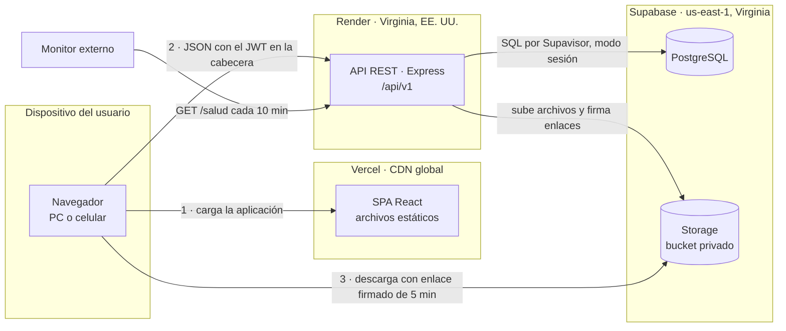
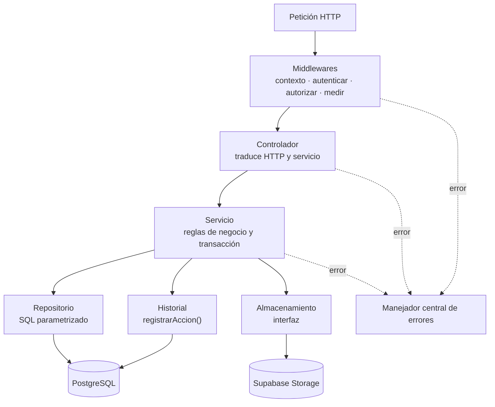
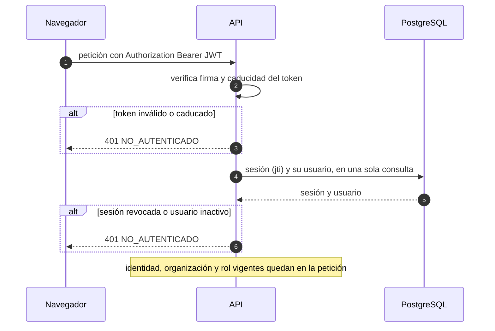
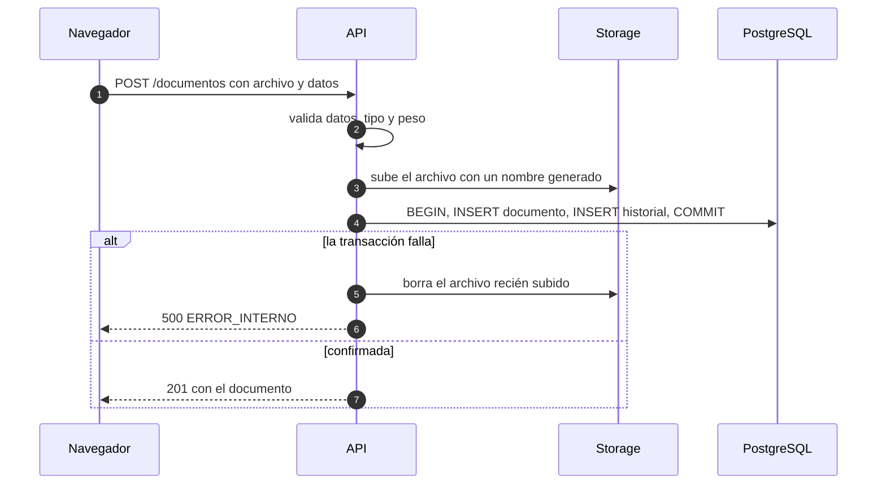
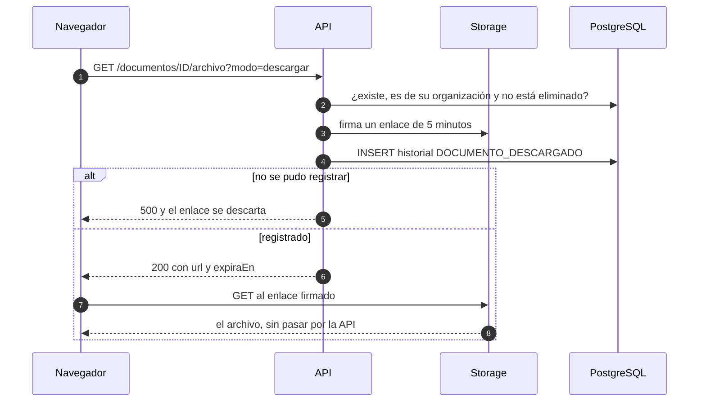
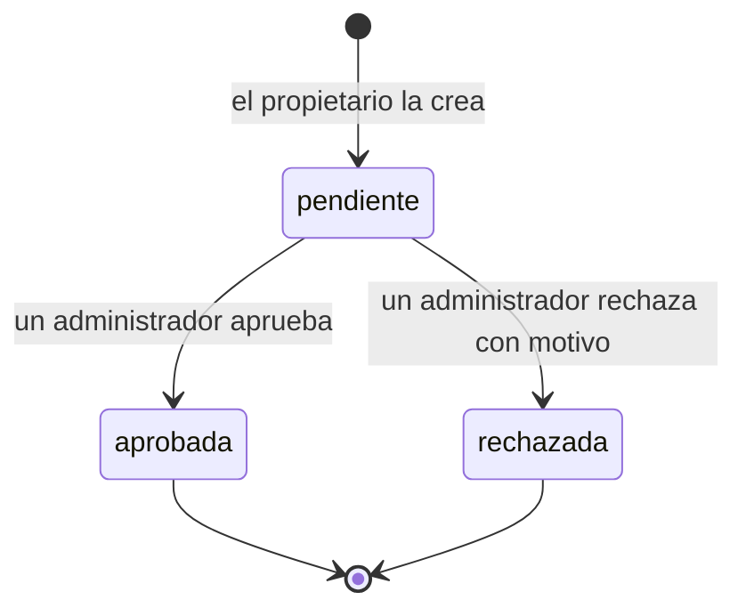

# 02 · Arquitectura

## 1. Vista general

Todo viaja por HTTPS o TLS. El navegador nunca habla con la base de datos, y con Storage solo para
descargar un archivo con un enlace que la API firmó después de autorizar y registrar.

## 2. Estilo: tres capas, un monolito modular

| Capa | Pieza | Responsabilidad |
|---|---|---|
| Presentación | SPA React | Pantallas, navegación y formularios. No decide permisos: oculta lo que la API dice que no se puede hacer |
| Aplicación | API Express | Autenticación, autorización, reglas de negocio, transacciones e historial |
| Datos | PostgreSQL y Storage | Persistencia, integridad (claves foráneas y restricciones) y archivos |

Un solo servicio de backend, organizado en módulos: auth, usuarios, categorías, documentos,
solicitudes, notificaciones e historial. Los microservicios están fuera del alcance, y para siete
módulos y cinco usuarios solo añadirían red y despliegues.

## 3. Dentro de la API

- **Middlewares.** `contexto` asigna un id a la petición y deduce si viene de un móvil; `autenticar`
  resuelve la sesión; `autorizar` exige el rol y, si falla, responde 403 y registra
  `ACCESO_DENEGADO`; `medir` guarda el tiempo de respuesta del listado.
- **Controlador.** Valida la entrada con el esquema Zod del endpoint, llama al servicio y elige el
  código de estado. Ni SQL ni reglas. Por qué la validación vive aquí y no en un middleware:
  [Estructura §6](05-estructura.md).
- **Servicio.** Las reglas de negocio y la transacción. No conoce Express —no recibe `req` ni
  `res`—, así que se prueba sin levantar un servidor.
- **Repositorio.** SQL parametrizado y la traducción entre `snake_case` y `camelCase`. Ninguna regla.
- **Historial.** `registrarAccion()` recibe la conexión de la transacción en curso: el registro y la
  operación se confirman o se deshacen juntos.
- **Errores.** Todos acaban en un único manejador, que produce el formato descrito en la [API](04-api.md).

## 4. Flujos críticos

### 4.1 Autenticación en cada petición

El rol y la organización se leen de la base, no del token: un cambio de rol o una desactivación
valen desde la petición siguiente.

### 4.2 Subir un documento

El archivo se sube **antes** de la transacción. Al revés, un fallo de Storage después de confirmar
dejaría un documento que apunta a un archivo inexistente. Así, lo peor que puede pasar es un archivo
huérfano que nada referencia, y aun así se intenta borrar.

### 4.3 Ver o descargar

El enlace se firma antes de registrar y se entrega después: si el registro falla, el enlace existe,
pero nadie lo recibe.

### 4.4 Ciclo de una solicitud de aprobación

Cada transición es una transacción: el cambio de estado, su registro en el historial y las
notificaciones. La resolución solo se aplica si la solicitud sigue pendiente; si dos administradores
resuelven a la vez, el segundo recibe 409 `SOLICITUD_RESUELTA`.

## 5. Despliegue

| Pieza | Servicio y plan | Región | Límites que condicionan el diseño |
|---|---|---|---|
| SPA | Vercel, Hobby | CDN global | Solo uso no comercial |
| API | Render, web service Free | Virginia | 512 MB de RAM y 0,1 CPU; se duerme tras 15 min sin tráfico y tarda alrededor de un minuto en despertar; 750 h al mes; 5 GB de salida al mes; disco efímero; puertos SMTP bloqueados |
| Base de datos | Supabase, Free | us-east-1 | 500 MB; se pausa tras 7 días sin actividad; sin copias de seguridad |
| Archivos | Supabase Storage, Free | us-east-1 | 1 GB; 50 MB por archivo (usamos 10); 5 GB de salida al mes |
| Monitor | UptimeRobot o cron-job.org, gratis | — | — |

**Entornos.** Desarrollo: API y frontend en local, contra un proyecto de Supabase «desarrollo».
Producción: Render y Vercel, contra un proyecto «producción». Son los dos proyectos activos que
permite el plan gratuito, y mantienen los datos de la evaluación lejos de las pruebas.

**Sin tarjeta registrada** en ningún proveedor: si se supera un límite, el servicio se restringe o
se suspende en vez de cobrar.

## 6. Seguridad

| Amenaza | Control |
|---|---|
| Robo de la base de datos | Contraseñas con bcrypt (coste 10); nunca en claro, tampoco en el historial |
| Fuerza bruta contra el inicio de sesión | Límite de intentos fallidos por IP (RN20); el mismo mensaje, y el mismo tiempo de respuesta, para un correo inexistente que para una contraseña errónea |
| Robo del token | Caduca en 8 h y se puede revocar; contra XSS, el escapado de React y una CSP estricta en Vercel |
| Escalada de privilegios | Rol leído de la base en cada petición; matriz aplicada solo en la API; cada 403 queda registrado |
| Acceso a datos de otra organización | Organización tomada de la sesión; UUID imposibles de adivinar; claves foráneas compuestas (M2); lo ajeno responde 404 |
| Inyección SQL | Solo consultas parametrizadas |
| Archivo malicioso | Lista blanca de tipos, 10 MB, nombre generado por el servidor, bucket privado y servido desde el dominio de Supabase, no desde el de la aplicación |
| Lectura de tablas por la API automática de Supabase | Data API desactivada y RLS activo sin políticas (D14) |
| Secretos en el repositorio | Variables de entorno; `.env` ignorado por git; la clave secreta de Supabase solo existe en Render |
| Manipulación del historial | Solo inserción, impuesto por un trigger (M4) |
| Errores que revelan el interior | Manejador central: en producción, un 500 no lleva trazas ni SQL |
| Peticiones desde otros sitios | CORS solo admite el origen del frontend |

## 7. Decisiones técnicas

Cada una dice qué se decidió, por qué y qué se descartó. Las decisiones de datos están en el
[modelo de datos](03-modelo-datos.md) (M1–M10) y las de código, en la [estructura](05-estructura.md) (E1–E5).

### Las preguntas del jurado

**D1 · Una API propia entre el navegador y los datos.** Toda lectura y escritura pasa por Express. Es
la única forma de garantizar que cada acción quede en el historial dentro de su misma transacción
—lecturas incluidas: búsquedas y descargas— y de tener las reglas de negocio en un solo sitio.
*Descartado:* usar Supabase como backend completo (su Auth y su API automática con RLS) llamado desde
React. El navegador escribiría directamente y el registro dependería del cliente: un corte de red a
mitad de camino, y el indicador 4 pierde una acción.

**D2 · PostgreSQL.** Los datos son relacionales por naturaleza —organización, usuarios, documentos,
solicitudes— y la integridad se puede exigir en la propia base: claves foráneas, restricciones,
índices únicos parciales y transacciones. Los indicadores, además, se calculan con SQL estándar.
*Descartado:* una base documental (MongoDB, Firestore). Sin claves foráneas, la coherencia entre
documento, solicitud e historial dependería solo del código.

**D3 · React, como SPA.** Una aplicación que vive detrás de un inicio de sesión no gana nada con el
renderizado en servidor: compilada a archivos estáticos, se sirve gratis desde una CDN y solo habla
con la API. React aporta componentes reutilizables y el ecosistema más amplio.
*Descartado:* Next.js (el renderizado en servidor no aporta detrás de un login y complica el
despliegue) y Angular (más estructura de la que piden una decena de pantallas).

**D4 · JWT, pero revocable.** El token, firmado con HS256 y válido 8 horas, solo lleva el id del
usuario y el de su sesión (`jti`). En cada petición la API comprueba esa sesión y al usuario en la
base, con una consulta que haría falta de todos modos para leer el rol vigente. Así, cerrar sesión,
desactivar a alguien o cambiarle el rol surte efecto al instante; la firma, por su parte, rechaza un
token manipulado o caducado sin tocar la base.
*Descartado:* JWT sin estado. Un usuario desactivado seguiría entrando hasta que caducara su token, y
eso es exactamente un acceso incorrecto para el indicador 6.

### Sesión, permisos y registro

**D5 · El token viaja en la cabecera Authorization, no en una cookie.** El frontend (`vercel.app`) y
la API (`onrender.com`) están en dominios distintos, así que una cookie de sesión sería de terceros,
y Safari —el navegador del iPhone— las bloquea por defecto: iniciar sesión desde un iPhone fallaría,
y eso es el indicador 5.
*Descartado:* cookie httpOnly, que exige poner ambos bajo un dominio propio (cuesta dinero). El
riesgo que se acepta —un token en `localStorage` es legible si hubiera XSS— se acota con el escapado
de React, una CSP estricta y la caducidad de 8 horas.

**D6 · La organización como entidad.** El registro crea una organización y su primer administrador;
todo dato cuelga de una organización, y la API filtra siempre por la de la sesión. Es lo mínimo que
hace coherentes dos puntos del alcance —«registro» y «categorías definidas por cada organización»— y
permite evaluar con personas de varias MYPEs sin mezclar sus documentos.
*Descartado:* una instalación por empresa (el «registro» no tendría sentido y dos MYPEs necesitarían
dos despliegues) y el multi-tenant real (esquemas por cliente, RLS, subdominios, planes), excluido
del alcance. Añadir la organización más adelante obligaría a tocar todas las tablas, consultas y pruebas.

**D7 · El historial se escribe en la misma transacción que la acción.** Cada servicio abre una
transacción, ejecuta la operación y llama a `registrarAccion()` con la misma conexión: se confirman
las dos cosas o ninguna.
*Descartado:* triggers de auditoría. No ven las lecturas (búsquedas, descargas), no saben qué usuario
de la aplicación actuó y son más difíciles de probar. Sí se usa un trigger, pero solo para impedir que
el historial se modifique (M4).

**D8 · El frontend oculta; la API decide.** La interfaz esconde lo que el rol no permite, pero no
bloquea rutas por rol: si un usuario teclea `/admin/usuarios`, la página pide los datos, la API
responde 403 y lo registra. Si el bloqueo ocurriera en el navegador, ese intento no llegaría al
servidor y el indicador 6 no lo vería. Para no duplicar la matriz de permisos en el frontend, la API
devuelve con cada documento qué puede hacer con él quien lo consulta.
*Descartado:* guardas de ruta por rol en React: una segunda copia de la matriz, que tarde o temprano
diverge de la primera.

### Archivos

**D9 · Archivos en Supabase Storage, servidos con enlace firmado.** Bucket privado: la API firma un
enlace de 5 minutos después de autorizar y registrar, y el navegador descarga directamente de
Supabase. Mismo proveedor que la base, 1 GB gratis y sin tarjeta. Además, las descargas no
atraviesan Render, cuyo plan gratuito tiene 0,1 CPU y 5 GB de salida al mes.
*Descartado:* el disco de Render (se borra en cada reinicio), Amazon S3 (pide tarjeta y cobra al
salir de la capa gratuita) y Cloudinary (pensado para imágenes).

**D10 · La subida pasa por la API.** La validación (tipo y peso) y el registro ocurren en un solo
punto, y con un tope de 10 MB el archivo cabe en memoria.
*Descartado:* la subida directa del navegador a Storage con un enlace firmado de subida. Ahorraría
tráfico en Render, pero son dos pasos, deja archivos huérfanos si el segundo falla y el registro
dependería de que el navegador complete el proceso. Si el volumen creciera, sería el cambio natural.

### Infraestructura

**D11 · API y base de datos en la misma región: Virginia, EE. UU.** Cada petición hace varias
consultas; con la API y la base en regiones distintas, cada consulta pagaría el viaje de ida y vuelta.
Juntas, el único tramo largo es navegador → API, una vez por petición. Render no tiene región en
Sudamérica, así que la base va a us-east-1 aunque Supabase ofrezca São Paulo.
*Descartado:* Supabase en São Paulo con la API en Virginia.

**D12 · Conexión por Supavisor en modo sesión.** La conexión directa de Supabase solo funciona por
IPv6, y Render solo sale por IPv4: sin esto, la API no conecta (`ENETUNREACH`). El pooler en modo
sesión usa IPv4 y se comporta como una conexión normal, transacciones incluidas.
*Descartado:* el complemento IPv4 de Supabase, que es de pago.

**D13 · Un monitor externo mantiene despierta la API.** Render gratuito duerme la API tras 15 minutos
sin tráfico y tarda alrededor de un minuto en despertarla: la primera persona de cada sesión de
evaluación esperaría un minuto (indicador 7) o vería un error (indicador 5). Un monitor gratuito
llama a `/salud` cada 10 minutos, y las 750 horas mensuales de Render cubren una instancia encendida
todo el mes, siempre que sea la única gratuita del workspace. Como `/salud` consulta una tabla real,
mantiene activo también el proyecto de Supabase, que se pausa tras 7 días sin actividad. Y su
registro de caídas es evidencia externa de disponibilidad.
*Descartado:* un plan de pago de Render, y «abrir la página un rato antes», que depende de acordarse.

**D14 · Supabase se usa como PostgreSQL y almacén, nada más.** Ni Supabase Auth, ni su API automática,
ni Realtime. Se desactiva la Data API y, por si se reactivara, se activa RLS sin políticas en cada
tabla, de modo que nadie pueda leerlas por esa vía; la API se conecta como dueña de las tablas, a la
que RLS no se aplica. De paso, la base es PostgreSQL estándar: cambiar de proveedor es cambiar una
cadena de conexión.

**D15 · Notificaciones dentro del sistema.** Una tabla que la interfaz consulta al navegar y al
volver a la pestaña.
*Descartado:* el correo electrónico —Render gratuito bloquea los puertos SMTP y los proveedores por
API exigen un dominio propio para escribir a terceros— y las notificaciones push o por websockets,
fuera del alcance.

**D16 · En desarrollo y en las pruebas, los archivos van a una carpeta local.** Una segunda
implementación del almacenamiento imita a Supabase: la API firma un enlace con caducidad (HMAC) y una
ruta propia sirve el archivo solo si la firma y el plazo son válidos. Así el sistema completo funciona
en una sola máquina, sin cuentas, y las pruebas suben y descargan archivos de verdad en vez de usar un
doble. En producción el arranque lo impide: el disco de Render se borra en cada reinicio.
*Descartado:* depender de un proyecto de Supabase para desarrollar (lento, con datos compartidos, y
gasta uno de los dos proyectos gratuitos) y un doble en memoria (no habría probado la firma de enlaces).

## 8. Riesgos

| # | Riesgo | Mitigación |
|---|---|---|
| R1 | La API está dormida cuando empieza una sesión de evaluación: alrededor de un minuto de espera | Monitor cada 10 minutos (D13). Plan B: abrir `/salud` dos minutos antes |
| R2 | Supabase pausa el proyecto tras 7 días sin actividad, por ejemplo entre la preprueba y la posprueba, o antes de sustentar | `/salud` consulta una tabla real. Si aun así se pausa, se restaura desde el panel sin perder datos; revisarlo la semana previa a cada hito |
| R3 | El plan gratuito de Supabase no tiene copias de seguridad, y el historial es la evidencia del capítulo 3 | Exportar el historial y los tiempos de respuesta al cerrar cada sesión de evaluación, y guardarlos fuera de Supabase |
| R4 | Los problemas de infraestructura aparecen en la Fase 7, sin margen | Desplegar desde la Fase 1 |
| R5 | Agotar una cuota: 1 GB de archivos y 5 GB de salida en Supabase, 5 GB de salida en Render | Tope de 10 MB por archivo, y los archivos no salen por Render. Con cinco usuarios el margen es amplio; revisar el panel de uso cada semana durante la evaluación |
| R6 | Un proveedor cambia su capa gratuita, como hizo Render el 1 de agosto de 2026 al bajar la salida incluida de 100 GB a 5 GB | PostgreSQL estándar y almacenamiento detrás de una interfaz: cada pieza tiene alternativa sin reescribir la lógica |
| R7 | Vercel Hobby es solo para uso no comercial | La tesis lo es. Si una MYPE lo adoptara después, el frontend es estático y se mueve a otro hosting sin cambios |

## 9. Encaje con Cloud Computing

Para el marco teórico: las cinco características esenciales de la definición del NIST (SP 800-145) y
dónde se ven en el sistema.

| Característica | En este sistema |
|---|---|
| Autoservicio bajo demanda | Una MYPE se registra y empieza a usarlo sin intervención de nadie |
| Amplio acceso por red | Un navegador en PC o celular, desde cualquier lugar (indicador 5) |
| Agrupación de recursos | Varias organizaciones comparten la misma infraestructura, aisladas lógicamente |
| Elasticidad rápida | La API no guarda estado en memoria (salvo el limitador de intentos), así que en un plan de pago podría replicarse. En el gratuito no se usa, y conviene decirlo así |
| Servicio medido | El propio sistema mide su uso (historial, tiempos de respuesta) y los proveedores miden el consumo de cada recurso |

Modelo de servicio: el sistema se ofrece como **SaaS** a las MYPEs y está construido sobre **PaaS**
(Render, Vercel) y sobre servicios gestionados de base de datos y almacenamiento (Supabase). Modelo de
despliegue: nube pública.
