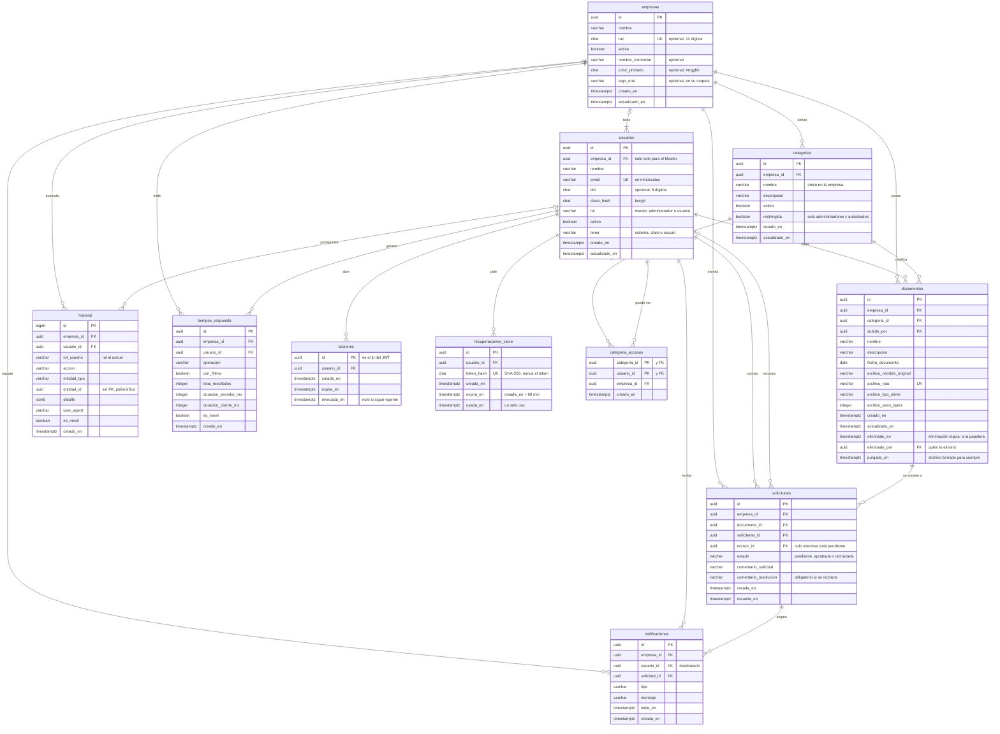

# 03 · Modelo de datos

Once tablas en PostgreSQL, compartidas por todas las empresas (v2: multiempresa por columna, D6). Nombres en español, en plural y en `snake_case`; claves primarias UUID
salvo en el historial; instantes en `timestamptz` (UTC). Extensiones: `unaccent` y `pg_trgm`, ambas
disponibles en Supabase.

**Implementación:** [`backend/migraciones/001_esquema_inicial.sql`](../backend/migraciones/001_esquema_inicial.sql),
con lo que añadieron las migraciones posteriores: 002 y 003 cierran la API automática de Supabase; 004
crea los permisos por categoría (`categoria_accesos`, D22); 005, la papelera (D23); 006, la auditoría del
Master (D24); 007, los respaldos en el catálogo del historial (D25).
Cada regla de la §3 tiene su prueba automática en
[`backend/tests/integracion/esquema.test.ts`](../backend/tests/integracion/esquema.test.ts), que comprueba
el error de PostgreSQL y el nombre exacto de la restricción que lo produce. El aislamiento con RLS
(§3.1) se prueba en [`rls.test.ts`](../backend/tests/integracion/rls.test.ts).

## 1. Diagrama entidad-relación

## 2. Diccionario de datos

«Ahora» significa que el valor por defecto es el instante de la inserción.

### empresas

| Campo | Tipo | Nulo | Restricciones | Descripción |
|---|---|---|---|---|
| id | uuid | no | PK | |
| nombre | varchar(150) | no | | Razón social o nombre comercial |
| ruc | char(11) | sí | 11 dígitos; único | Informativo; no se valida contra SUNAT |
| activa | boolean | no | por defecto, verdadero | Desactivada, nadie de ella puede entrar (RN24) |
| nombre_comercial | varchar(60) | sí | no vacío | El que se ve en el menú; sin él, el nombre (RN31) |
| color_primario | char(7) | sí | `#rrggbb` en minúsculas | El de botones y enlaces; el contraste lo valida la API (RN31) |
| logo_ruta | varchar(255) | sí | `<empresa>/<uuid>.png` o `.jpg`, en la carpeta de esta empresa | En el bucket privado de los documentos (RN31) |
| creado_en | timestamptz | no | ahora | |
| actualizado_en | timestamptz | no | ahora | |

### usuarios

| Campo | Tipo | Nulo | Restricciones | Descripción |
|---|---|---|---|---|
| id | uuid | no | PK | |
| empresa_id | uuid | sí | FK → empresas; nulo si y solo si el rol es `master` | |
| nombre | varchar(120) | no | | Nombre visible |
| email | varchar(254) | no | único; en minúsculas | Correo de acceso, único en todo el sistema (RN02) |
| dni | char(8) | sí | 8 dígitos | Dato del perfil; nunca una credencial |
| clave_hash | char(60) | no | | Hash bcrypt; la contraseña nunca se guarda |
| rol | varchar(13) | no | `master`, `administrador` o `usuario`; un solo `master` | |
| activo | boolean | no | por defecto, verdadero | |
| tema | varchar(7) | no | `sistema`, `claro` u `oscuro`; por defecto, `sistema` | El de su interfaz, en cualquier dispositivo (RN32) |
| creado_en | timestamptz | no | ahora | |
| actualizado_en | timestamptz | no | ahora | |

Además, único (`id`, `empresa_id`), que necesitan las claves foráneas compuestas (M2), y un índice
único parcial que admite una sola fila con rol `master` (RN22).

### sesiones

| Campo | Tipo | Nulo | Restricciones | Descripción |
|---|---|---|---|---|
| id | uuid | no | PK | Es el `jti` del JWT |
| usuario_id | uuid | no | FK → usuarios | |
| creada_en | timestamptz | no | ahora | |
| expira_en | timestamptz | no | | `creada_en` + 8 h |
| revocada_en | timestamptz | sí | | Se llena al cerrar sesión, al desactivar al usuario o a su empresa, o al cambiar o restablecer su contraseña |

### recuperaciones_clave

| Campo | Tipo | Nulo | Restricciones | Descripción |
|---|---|---|---|---|
| id | uuid | no | PK | |
| usuario_id | uuid | no | FK → usuarios | |
| token_hash | char(64) | no | único | Huella SHA-256 del token: con ella no se puede entrar (M12) |
| creada_en | timestamptz | no | ahora | |
| expira_en | timestamptz | no | posterior a `creada_en` | `creada_en` + 60 minutos, con el reloj de la base |
| usada_en | timestamptz | sí | | Se llena al usarlo o al pedir otro: un enlace sirve una sola vez (RN26) |

### categorias

| Campo | Tipo | Nulo | Restricciones | Descripción |
|---|---|---|---|---|
| id | uuid | no | PK | |
| empresa_id | uuid | no | FK → empresas | |
| nombre | varchar(80) | no | único en la empresa, sin distinguir mayúsculas | |
| descripcion | varchar(255) | sí | | |
| activa | boolean | no | por defecto, verdadero | Las inactivas no se ofrecen para documentos nuevos (RN08) |
| restringida | boolean | no | por defecto, falso | Solo la ven los administradores y las personas de `categoria_accesos` (RN29) |
| creado_en | timestamptz | no | ahora | |
| actualizado_en | timestamptz | no | ahora | |

Además, único (`id`, `empresa_id`).

### categoria_accesos

Quién puede ver una categoría restringida (RF25). Es configuración, no un dato de negocio: es la única
tabla en la que `app_empresa` puede borrar, porque quitar el acceso a alguien es borrar su fila. Cada
cambio queda en el historial (`CATEGORIA_EDITADA`).

| Campo | Tipo | Nulo | Restricciones | Descripción |
|---|---|---|---|---|
| categoria_id | uuid | no | PK; FK (`categoria_id`, `empresa_id`) → categorias | |
| usuario_id | uuid | no | PK; FK (`usuario_id`, `empresa_id`) → usuarios | Solo personas de la misma empresa |
| empresa_id | uuid | no | FK → empresas | |
| creado_en | timestamptz | no | ahora | |

### documentos

| Campo | Tipo | Nulo | Restricciones | Descripción |
|---|---|---|---|---|
| id | uuid | no | PK | Lo genera la API antes de subir el archivo |
| empresa_id | uuid | no | FK → empresas | |
| categoria_id | uuid | no | FK (`categoria_id`, `empresa_id`) → categorias | |
| subido_por | uuid | no | FK (`subido_por`, `empresa_id`) → usuarios | Propietario |
| nombre | varchar(200) | no | | Título visible: es lo que se busca |
| descripcion | varchar(1000) | sí | | |
| fecha_documento | date | no | | Fecha del propio documento (emisión, firma); se filtra por ella |
| archivo_nombre_original | varchar(255) | no | | Con este nombre se descarga |
| archivo_ruta | varchar(300) | no | único | Clave en Storage: `{empresa_id}/{id}.{extensión}`; la carpeta es la empresa |
| archivo_tipo_mime | varchar(100) | no | | De la lista blanca (RN09) |
| archivo_peso_bytes | integer | no | entre 1 y 10 485 760 | |
| version | integer | no | ≥ 1; por defecto, 1 | La versión vigente: las columnas de archivo son las suyas (D30) |
| creado_en | timestamptz | no | ahora | Instante de la subida |
| actualizado_en | timestamptz | no | ahora | |
| eliminado_en | timestamptz | sí | | Eliminación lógica (M5): desde aquí, el documento está en la papelera (RN28) |
| eliminado_por | uuid | sí | FK (`eliminado_por`, `empresa_id`) → usuarios | Quién lo eliminó; nulo en lo eliminado antes de la migración 005 |
| purgado_en | timestamptz | sí | solo si `eliminado_en` no es nulo | El archivo ya no está en el almacenamiento; la fila queda como constancia y no se restaura |

Además, único (`id`, `empresa_id`).

### solicitudes

| Campo | Tipo | Nulo | Restricciones | Descripción |
|---|---|---|---|---|
| id | uuid | no | PK | |
| empresa_id | uuid | no | FK → empresas | |
| documento_id | uuid | no | FK (`documento_id`, `empresa_id`) → documentos | |
| solicitante_id | uuid | no | FK (`solicitante_id`, `empresa_id`) → usuarios | |
| revisor_id | uuid | sí | FK (`revisor_id`, `empresa_id`) → usuarios | Administrador que la resolvió |
| estado | varchar(9) | no | `pendiente`, `aprobada` o `rechazada`; por defecto, `pendiente` | |
| comentario_solicitud | varchar(500) | sí | | |
| comentario_resolucion | varchar(500) | sí | obligatorio si se rechaza | |
| creada_en | timestamptz | no | ahora | |
| resuelta_en | timestamptz | sí | | |
| version | integer | no | ≥ 1 | La versión del documento que se pidió aprobar (D30) |

### documento_versiones

Cada versión de un documento (RF34, D30). Solo se inserta: ninguna se modifica ni se borra.

| Campo | Tipo | Nulo | Restricciones | Descripción |
|---|---|---|---|---|
| id | uuid | no | PK | |
| empresa_id | uuid | no | FK → empresas | |
| documento_id | uuid | no | FK (`documento_id`, `empresa_id`) → documentos | |
| numero | integer | no | ≥ 1; único con `documento_id` | 1, 2, 3…; la vigente es la del documento |
| archivo_nombre_original | varchar(255) | no | | Con este nombre se descarga esa versión |
| archivo_ruta | varchar(300) | no | único | Clave en Storage; una restauración tiene su propia copia |
| archivo_tipo_mime | varchar(100) | no | | De la lista blanca (RN09) |
| archivo_peso_bytes | integer | no | entre 1 y 10 485 760 | |
| subida_por | uuid | no | FK (`subida_por`, `empresa_id`) → usuarios | |
| comentario | varchar(500) | sí | no vacío | Qué cambió |
| restaurada_de | integer | sí | ≥ 1 y menor que `numero` | Si es una restauración, de qué versión se copió |
| creada_en | timestamptz | no | ahora | |

### notificaciones

| Campo | Tipo | Nulo | Restricciones | Descripción |
|---|---|---|---|---|
| id | uuid | no | PK | |
| empresa_id | uuid | no | FK → empresas | |
| usuario_id | uuid | no | FK (`usuario_id`, `empresa_id`) → usuarios | Destinatario |
| solicitud_id | uuid | no | FK (`solicitud_id`, `empresa_id`) → solicitudes | Desde aquí, la interfaz lleva al documento |
| tipo | varchar(19) | no | `SOLICITUD_CREADA`, `SOLICITUD_APROBADA` o `SOLICITUD_RECHAZADA` | |
| mensaje | varchar(300) | no | | Texto ya redactado: no cambia si después cambia el documento |
| leida_en | timestamptz | sí | | |
| creada_en | timestamptz | no | ahora | |

### historial

| Campo | Tipo | Nulo | Restricciones | Descripción |
|---|---|---|---|---|
| id | bigint | no | PK, autoincremental | Orden exacto de inserción |
| empresa_id | uuid | sí | FK → empresas | La del autor o, si actúa el Master, la de la empresa sobre la que actúa. Nulo en lo que no es de ninguna empresa: un correo desconocido, o el Master en su propia cuenta |
| usuario_id | uuid | sí | FK → usuarios; su empresa debe ser la del asiento, salvo el Master (M11) | Quién; nulo si no hay autor |
| rol_usuario | varchar(13) | sí | el rol actual del autor (M11) | Rol que tenía al actuar (indicador 6) |
| accion | varchar(30) | no | una de las 30 de [Análisis §7](01-analisis.md) | Qué |
| entidad_tipo | varchar(12) | sí | `empresa`, `usuario`, `sesion`, `categoria`, `documento` o `solicitud` | Sobre qué |
| entidad_id | uuid | sí | sin FK (M3) | |
| detalle | jsonb | no | por defecto, `{}` | Lo propio de cada acción: antes → después, filtros, correo intentado, ruta denegada |
| user_agent | varchar(300) | sí | | |
| es_movil | boolean | sí | | Deducido del user-agent (indicador 5) |
| creado_en | timestamptz | no | ahora | Cuándo |

Inalterable: un trigger rechaza UPDATE, DELETE y TRUNCATE (M4).

### tiempos_respuesta

| Campo | Tipo | Nulo | Restricciones | Descripción |
|---|---|---|---|---|
| id | uuid | no | PK | Lo genera la API y lo devuelve con el listado, para que el navegador complete su parte |
| empresa_id | uuid | no | FK → empresas | |
| usuario_id | uuid | no | FK (`usuario_id`, `empresa_id`) → usuarios | |
| operacion | varchar(30) | no | por ahora, solo `LISTAR_DOCUMENTOS` | |
| con_filtros | boolean | no | | Distingue un listado de una búsqueda |
| total_resultados | integer | no | | |
| duracion_servidor_ms | integer | no | | Desde que llega la petición hasta que sale la respuesta |
| duracion_cliente_ms | integer | sí | entre 0 y 120 000 | Lo que esperó la persona: de pedir el listado a verlo en pantalla. Se completa una sola vez |
| es_movil | boolean | no | | |
| creado_en | timestamptz | no | ahora | |

## 3. Reglas que impone la propia base

No dependen de que el código se acuerde de comprobarlas.

| Regla | Cómo |
|---|---|
| Nada apunta a otra empresa (RN01) | Claves foráneas compuestas con `empresa_id` (M2) |
| Ninguna consulta de la API ve filas de otra empresa (RN01) | RLS con la empresa de la transacción (§3.1) |
| Un solo Master, sin empresa (RN22) | Índice único parcial sobre `rol = 'master'` y comprobación de que el Master, y solo él, no tiene empresa |
| El historial no atribuye a una empresa la acción de alguien de otra | Trigger que comprueba el rol y la empresa del autor; la excepción es el Master, escrita en el propio trigger (M11) |
| Correo único y en minúsculas (RN02) | Índice único y comprobación de que el correo ya está en minúsculas |
| RUC único (RN21) | Índice único; varios nulos están permitidos |
| Categoría única por empresa (RN08) | Índice único sobre la empresa y el nombre en minúsculas |
| Una sola solicitud pendiente por documento (RN12) | Índice único parcial sobre `documento_id`, limitado a las pendientes |
| Nadie resuelve su propia solicitud (RN13) | `revisor_id` distinto de `solicitante_id` |
| El rechazo exige motivo (RN14) | Si el estado es `rechazada`, `comentario_resolucion` no puede ser nulo |
| Coherencia de la solicitud | Pendiente si y solo si no tiene revisor ni fecha de resolución |
| Peso máximo del archivo (RN09) | `archivo_peso_bytes` entre 1 y 10 485 760 |
| Historial inalterable (RN17) | Trigger que rechaza UPDATE, DELETE y TRUNCATE |
| Solo se autoriza a personas de la propia empresa (RN29) | Claves foráneas compuestas de `categoria_accesos` |
| Una categoría restringida no se ve sin acceso (RN29) | Políticas RLS restrictivas: `puede_ver_categoria()` en `categorias` y `categorias_visibles()` en `documentos` (§3.1) |
| Solo se purga lo que está en la papelera (RN28) | `purgado_en` exige `eliminado_en` |
| Solo el administrador cambia la identidad de su empresa, y nada más de ella (RN31) | `app_empresa` solo puede actualizar `nombre_comercial`, `color_primario` y `logo_ruta`, y una política de UPDATE exige su empresa y el rol `administrador` (§3.1) |
| El logo de una empresa está en su carpeta | `logo_ruta` debe empezar por el `id` de la empresa |
| Una versión no cambia ni se borra (RN33) | `app_empresa` solo tiene SELECT e INSERT sobre `documento_versiones` |
| Cada número de versión, una vez por documento | Único (`documento_id`, `numero`); el número lo decide la API con el documento bloqueado |
| Una versión oculta como su documento (RN29) | Política restrictiva: la versión solo se ve si su documento se ve (§3.1) |
| Nada se borra en cascada | Todas las claves foráneas restringen el borrado: empresas, usuarios y documentos no se borran |

### 3.1 Aislamiento con RLS (D17)

La API no consulta los datos de negocio con el rol dueño de las tablas. En cada transacción adopta uno
de dos roles sin inicio de sesión y fija la empresa activa con `set_config('app.empresa_id', …, true)`:

| Rol | Ve | Puede escribir | No tiene |
|---|---|---|---|
| `app_empresa` | Las filas de su empresa en todas las tablas de negocio; su propia empresa | Insertar y actualizar en usuarios, categorías, documentos, solicitudes, notificaciones y tiempos; insertar en el historial | DELETE en ninguna tabla; nada de otra empresa; recuperaciones de contraseña |
| `app_plataforma` (Master) | Empresas; usuarios con rol `administrador` | Crear y editar empresas y administradores; las categorías iniciales; insertar en el historial | Documentos, solicitudes, notificaciones, tiempos de respuesta y usuarios que no son administradores |

Si la transacción no fija empresa, `empresa_actual()` es nula y `app_empresa` no ve ninguna fila: el
fallo es cerrado. Dos funciones `SECURITY DEFINER`, ejecutables solo por `app_plataforma`, hacen lo que
el Master necesita y su rol no alcanza: `metricas_de_empresas()` devuelve conteos por empresa (nunca
contenido) y `revocar_sesiones_de_empresa()` cierra las sesiones de todos sus usuarios al desactivarla.

**Permisos por categoría (004, D22).** La transacción fija también quién actúa (`app.usuario_id`) y con
qué rol (`app.rol`), que leen `usuario_actual()` y `rol_actual()`. Sobre `categorias` y `documentos` hay
una política **restrictiva** —se suma con AND a la de aislamiento— que llama a `puede_ver_categoria()`
(`SECURITY DEFINER`, ejecutable solo por `app_empresa`): un administrador ve todas; los demás, las
abiertas y las restringidas en las que tienen acceso. La misma condición vale al insertar y al
actualizar un documento, así que nadie sube a una categoría que no ve. `categoria_accesos` solo la leen
y cambian los administradores. Sin persona fijada, nada restringido se abre.

**Visibilidad una vez por consulta (010, D31).** La política de `documentos` ya no llama a
`puede_ver_categoria()` por fila: compara `categoria_id` con `categorias_visibles()`, que devuelve en un
arreglo las categorías que ve quien actúa (la misma regla) y que PostgreSQL evalúa una vez por consulta. Con
50.000 documentos, el listado de una usuaria pasó de 1,9 s a 14 ms (`docs/evidencias/prueba-de-carga.md`).
`categorias` conserva su política: son pocas filas.

**Identidad de la empresa (008, D28).** Hasta la 008, `app_empresa` solo leía su fila de `empresas`.
Ahora puede actualizar tres columnas de ella —`nombre_comercial`, `color_primario` y `logo_ruta`, por
permiso de columna— y una política de UPDATE exige que sea su empresa y que quien actúa sea
administrador. Un usuario que lo intente por debajo de la API cambia cero filas; el nombre, el RUC o el
estado no los puede tocar nadie de la empresa (error 42501).

**Versiones (009, D30).** `documento_versiones` tiene la política de aislamiento por empresa y otra
restrictiva que exige que su documento exista para quien pregunta. Esa subconsulta pasa a su vez por la
RLS de `documentos`, así que una versión se ve exactamente cuando su documento se ve: las categorías
restringidas la ocultan sin reglas propias. El rol de empresa solo puede leer e insertar.

**Auditoría del Master (006, D24).** `app_plataforma` puede leer del historial los asientos sin empresa
y los que tienen el rol `master`; nada más.

## 4. Índices

Además de los únicos de la sección anterior.

| Tabla | Índice | Para qué |
|---|---|---|
| documentos | empresa + `creado_en` descendente, solo no eliminados | Listado por defecto |
| documentos | empresa + categoría, solo no eliminados | Filtro por categoría |
| documentos | empresa + `fecha_documento`, solo no eliminados | Filtro por fechas |
| documentos | Trigramas (GIN) sobre el nombre en minúsculas y sin tildes | Búsqueda por nombre (M8) |
| solicitudes | empresa + estado + `creada_en` descendente | Bandeja del administrador |
| solicitudes | solicitante + `creada_en` descendente | «Mis solicitudes» |
| notificaciones | usuario + `creada_en` descendente | Campana de notificaciones |
| sesiones | usuario, solo no revocadas | Revocar todas al desactivar a alguien |
| historial | empresa + `creado_en` descendente | Consulta y exportación |
| historial | empresa + usuario + `creado_en` descendente | Filtro por usuario |
| historial | empresa + `entidad_tipo` + `entidad_id` | Todo lo ocurrido a un documento concreto |
| usuarios | empresa | Listado de usuarios |
| recuperaciones_clave | usuario, solo no usadas | Anular los enlaces pendientes al pedir otro |
| categoria_accesos | usuario | Qué categorías restringidas ve alguien |
| documentos | empresa + `eliminado_en`, solo en la papelera (no purgados) | La papelera y la purga a los 30 días |
| historial | correo del detalle + `creado_en`, solo `SESION_FALLIDA` | Contar los fallos recientes de un correo (RN27) |

## 5. Decisiones de modelado

**M1 · Identificadores UUID.** No se pueden adivinar: aunque un control fallara, nadie recorre
`/documentos/1`, `/2`, `/3`… El historial usa un entero autoincremental, porque nunca aparece en una
URL y da el orden exacto de inserción.

**M2 · Claves foráneas compuestas con la empresa.** Un documento referencia su categoría con el
par (categoría, empresa), y lo mismo con usuarios, solicitudes, notificaciones y tiempos de respuesta.
Así la base impide que un documento apunte a la categoría de otra empresa aunque el código se
equivocara. Es la tercera capa del aislamiento, debajo del filtro del repositorio y de RLS (§3.1). Requiere un índice único (`id`, `empresa_id`) en las tablas referenciadas.

**M3 · Historial con referencia polimórfica.** `entidad_tipo` más `entidad_id`, sin clave foránea: una
sola tabla registra acciones sobre cualquier entidad, y el registro sobrevive aunque la entidad cambie.
Es el patrón habitual de las bitácoras de auditoría. Sí tiene claves foráneas hacia el usuario y la
empresa.

**M4 · Historial inalterable desde la base.** Un trigger rechaza UPDATE, DELETE y TRUNCATE sobre
`historial`. La garantía no depende de que la API «no lo haga»: la base no lo permite.

**M5 · Eliminación lógica.** `eliminado_en` en documentos. El historial sigue apuntando a algo que
existe, una eliminación por error se puede revertir desde la base y un documento subido por error deja
de ensuciar las búsquedas de la evaluación.

**M6 · El estado de aprobación vive en la solicitud.** El documento no tiene columna de estado: su
situación es la de su última solicitud, y así el mismo dato no se guarda en dos sitios. La regla «una
sola pendiente por documento» la impone un índice único parcial, no el código.

**M7 · Valores permitidos con CHECK, no con ENUM.** Roles, estados y acciones se restringen con
comprobaciones sobre texto: añadir o quitar un valor es una migración trivial, mientras que un ENUM de
PostgreSQL no permite quitar valores.

**M8 · Búsqueda sin distinguir tildes ni mayúsculas.** En un celular se escribe «cotizacion»; si eso no
encuentra «Cotización», bajan los indicadores 2 y 3. El nombre se normaliza (minúsculas y sin tildes,
con `unaccent`) y se indexa por trigramas (`pg_trgm`), que sirven para buscar fragmentos de palabra.
*Descartado:* la búsqueda de texto completo (`tsvector`), pensada para textos largos, no para títulos
cortos ni fragmentos.

**M9 · Sin IP en el historial.** Ningún indicador la necesita y es un dato personal (Ley 29733). Sí se
guardan el user-agent, del que sale `es_movil` (indicador 5), y el rol de quien actuó (indicador 6).

**M10 · Fechas.** Los instantes se guardan como `timestamptz`, en UTC, y la interfaz los muestra en hora
de Lima. La fecha propia de un documento es `date`, sin hora ni zona: un contrato es «del 15 de
septiembre», no de un instante.

**M11 · El autor del historial se comprueba con un trigger, no con una clave compuesta.** En la v1 el
par (usuario, empresa) era una clave foránea compuesta. El Master no tiene empresa pero sus acciones
sobre una empresa deben quedar en el historial de esa empresa, y una clave compuesta no admite esa
excepción. Un trigger `SECURITY DEFINER` comprueba que el rol del asiento es el del autor y que el
autor pertenece a la empresa del asiento, y deja pasar al Master por una línea con su nombre: la
excepción es explícita, no el efecto de una comprobación ausente.

**M12 · De la recuperación de contraseña se guarda la huella, no el token.** Quien leyera la tabla no
podría usar ningún enlace. El token tiene 256 bits aleatorios, así que basta SHA-256 sin sal; bcrypt
haría falta para algo que una persona elige, no para esto. Gastar un enlace es un solo UPDATE que
comprueba vigencia, que no esté usado y que el usuario y su empresa sigan activos.
