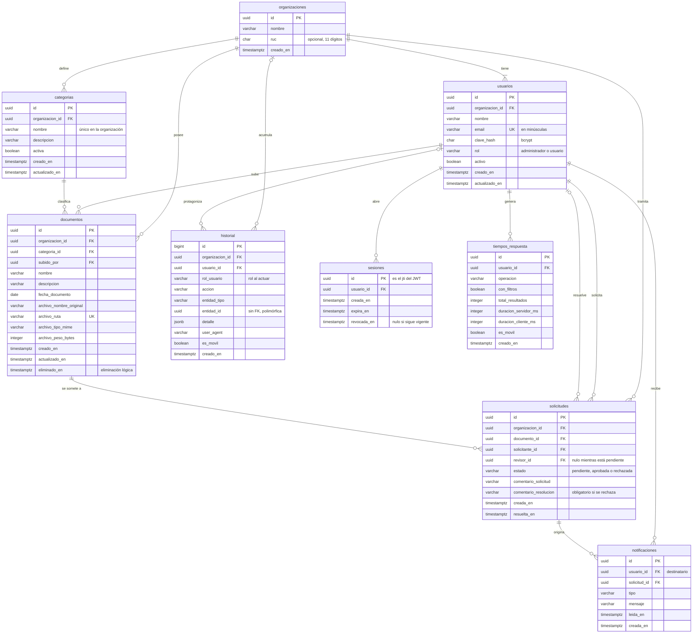

# 03 · Modelo de datos

Nueve tablas en PostgreSQL. Nombres en español, en plural y en `snake_case`; claves primarias UUID
salvo en el historial; instantes en `timestamptz` (UTC). Extensiones: `unaccent` y `pg_trgm`, ambas
disponibles en Supabase.

**Implementación:** [`backend/migraciones/001_esquema_inicial.sql`](../backend/migraciones/001_esquema_inicial.sql).
Cada regla de la §3 tiene su prueba automática en
[`backend/tests/integracion/esquema.test.ts`](../backend/tests/integracion/esquema.test.ts), que comprueba
el error de PostgreSQL y el nombre exacto de la restricción que lo produce.

## 1. Diagrama entidad-relación

## 2. Diccionario de datos

«Ahora» significa que el valor por defecto es el instante de la inserción.

### organizaciones

| Campo | Tipo | Nulo | Restricciones | Descripción |
|---|---|---|---|---|
| id | uuid | no | PK | |
| nombre | varchar(150) | no | | Razón social o nombre comercial |
| ruc | char(11) | sí | 11 dígitos | Informativo; no se valida contra SUNAT |
| creado_en | timestamptz | no | ahora | |

### usuarios

| Campo | Tipo | Nulo | Restricciones | Descripción |
|---|---|---|---|---|
| id | uuid | no | PK | |
| organizacion_id | uuid | no | FK → organizaciones | |
| nombre | varchar(120) | no | | Nombre visible |
| email | varchar(254) | no | único; en minúsculas | Correo de acceso, único en todo el sistema (RN02) |
| clave_hash | char(60) | no | | Hash bcrypt; la contraseña nunca se guarda |
| rol | varchar(13) | no | `administrador` o `usuario` | |
| activo | boolean | no | por defecto, verdadero | |
| creado_en | timestamptz | no | ahora | |
| actualizado_en | timestamptz | no | ahora | |

Además, único (`id`, `organizacion_id`), que necesitan las claves foráneas compuestas (M2).

### sesiones

| Campo | Tipo | Nulo | Restricciones | Descripción |
|---|---|---|---|---|
| id | uuid | no | PK | Es el `jti` del JWT |
| usuario_id | uuid | no | FK → usuarios | |
| creada_en | timestamptz | no | ahora | |
| expira_en | timestamptz | no | | `creada_en` + 8 h |
| revocada_en | timestamptz | sí | | Se llena al cerrar sesión, al desactivar al usuario o al cambiar su contraseña |

### categorias

| Campo | Tipo | Nulo | Restricciones | Descripción |
|---|---|---|---|---|
| id | uuid | no | PK | |
| organizacion_id | uuid | no | FK → organizaciones | |
| nombre | varchar(80) | no | único en la organización, sin distinguir mayúsculas | |
| descripcion | varchar(255) | sí | | |
| activa | boolean | no | por defecto, verdadero | Las inactivas no se ofrecen para documentos nuevos (RN08) |
| creado_en | timestamptz | no | ahora | |
| actualizado_en | timestamptz | no | ahora | |

Además, único (`id`, `organizacion_id`).

### documentos

| Campo | Tipo | Nulo | Restricciones | Descripción |
|---|---|---|---|---|
| id | uuid | no | PK | Lo genera la API antes de subir el archivo |
| organizacion_id | uuid | no | FK → organizaciones | |
| categoria_id | uuid | no | FK (`categoria_id`, `organizacion_id`) → categorias | |
| subido_por | uuid | no | FK (`subido_por`, `organizacion_id`) → usuarios | Propietario |
| nombre | varchar(200) | no | | Título visible: es lo que se busca |
| descripcion | varchar(1000) | sí | | |
| fecha_documento | date | no | | Fecha del propio documento (emisión, firma); se filtra por ella |
| archivo_nombre_original | varchar(255) | no | | Con este nombre se descarga |
| archivo_ruta | varchar(300) | no | único | Clave en Storage: `{organizacion_id}/{id}.{extensión}` |
| archivo_tipo_mime | varchar(100) | no | | De la lista blanca (RN09) |
| archivo_peso_bytes | integer | no | entre 1 y 10 485 760 | |
| creado_en | timestamptz | no | ahora | Instante de la subida |
| actualizado_en | timestamptz | no | ahora | |
| eliminado_en | timestamptz | sí | | Eliminación lógica (M5) |

Además, único (`id`, `organizacion_id`).

### solicitudes

| Campo | Tipo | Nulo | Restricciones | Descripción |
|---|---|---|---|---|
| id | uuid | no | PK | |
| organizacion_id | uuid | no | FK → organizaciones | |
| documento_id | uuid | no | FK (`documento_id`, `organizacion_id`) → documentos | |
| solicitante_id | uuid | no | FK (`solicitante_id`, `organizacion_id`) → usuarios | |
| revisor_id | uuid | sí | FK (`revisor_id`, `organizacion_id`) → usuarios | Administrador que la resolvió |
| estado | varchar(9) | no | `pendiente`, `aprobada` o `rechazada`; por defecto, `pendiente` | |
| comentario_solicitud | varchar(500) | sí | | |
| comentario_resolucion | varchar(500) | sí | obligatorio si se rechaza | |
| creada_en | timestamptz | no | ahora | |
| resuelta_en | timestamptz | sí | | |

### notificaciones

| Campo | Tipo | Nulo | Restricciones | Descripción |
|---|---|---|---|---|
| id | uuid | no | PK | |
| usuario_id | uuid | no | FK → usuarios | Destinatario |
| solicitud_id | uuid | no | FK → solicitudes | Desde aquí, la interfaz lleva al documento |
| tipo | varchar(19) | no | `SOLICITUD_CREADA`, `SOLICITUD_APROBADA` o `SOLICITUD_RECHAZADA` | |
| mensaje | varchar(300) | no | | Texto ya redactado: no cambia si después cambia el documento |
| leida_en | timestamptz | sí | | |
| creada_en | timestamptz | no | ahora | |

### historial

| Campo | Tipo | Nulo | Restricciones | Descripción |
|---|---|---|---|---|
| id | bigint | no | PK, autoincremental | Orden exacto de inserción |
| organizacion_id | uuid | sí | FK → organizaciones | Nulo solo en un inicio de sesión fallido con un correo que no existe |
| usuario_id | uuid | sí | FK (`usuario_id`, `organizacion_id`) → usuarios | Quién; nulo en el mismo caso |
| rol_usuario | varchar(13) | sí | | Rol que tenía al actuar (indicador 6) |
| accion | varchar(30) | no | una de las 22 de [Análisis §7](01-analisis.md) | Qué |
| entidad_tipo | varchar(12) | sí | `organizacion`, `usuario`, `sesion`, `categoria`, `documento` o `solicitud` | Sobre qué |
| entidad_id | uuid | sí | sin FK (M3) | |
| detalle | jsonb | no | por defecto, `{}` | Lo propio de cada acción: antes → después, filtros, correo intentado, ruta denegada |
| user_agent | varchar(300) | sí | | |
| es_movil | boolean | sí | | Deducido del user-agent (indicador 5) |
| creado_en | timestamptz | no | ahora | Cuándo |

Inalterable: un trigger rechaza UPDATE, DELETE y TRUNCATE (M4).

### tiempos_respuesta

| Campo | Tipo | Nulo | Restricciones | Descripción |
|---|---|---|---|---|
| id | uuid | no | PK | Lo genera la API y lo devuelve con el listado, para que el navegador complete su parte |
| usuario_id | uuid | no | FK → usuarios | |
| operacion | varchar(30) | no | por ahora, solo `LISTAR_DOCUMENTOS` | |
| con_filtros | boolean | no | | Distingue un listado de una búsqueda |
| total_resultados | integer | no | | |
| duracion_servidor_ms | integer | no | | Desde que llega la petición hasta que sale la respuesta |
| duracion_cliente_ms | integer | sí | entre 0 y 120 000 | Lo que esperó la persona: de pedir el listado a verlo en pantalla. Se completa una sola vez |
| es_movil | boolean | no | | |
| creado_en | timestamptz | no | ahora | |

## 3. Reglas que impone la propia base

No dependen de que el código se acuerde de comprobarlas.

| Regla | Cómo |
|---|---|
| Nada apunta a otra organización (RN01) | Claves foráneas compuestas con `organizacion_id` (M2) |
| Correo único y en minúsculas (RN02) | Índice único y comprobación de que el correo ya está en minúsculas |
| Categoría única por organización (RN08) | Índice único sobre la organización y el nombre en minúsculas |
| Una sola solicitud pendiente por documento (RN12) | Índice único parcial sobre `documento_id`, limitado a las pendientes |
| Nadie resuelve su propia solicitud (RN13) | `revisor_id` distinto de `solicitante_id` |
| El rechazo exige motivo (RN14) | Si el estado es `rechazada`, `comentario_resolucion` no puede ser nulo |
| Coherencia de la solicitud | Pendiente si y solo si no tiene revisor ni fecha de resolución |
| Peso máximo del archivo (RN09) | `archivo_peso_bytes` entre 1 y 10 485 760 |
| Historial inalterable (RN17) | Trigger que rechaza UPDATE, DELETE y TRUNCATE |
| Nada se borra en cascada | Todas las claves foráneas restringen el borrado: organizaciones, usuarios y documentos no se borran |

## 4. Índices

Además de los únicos de la sección anterior.

| Tabla | Índice | Para qué |
|---|---|---|
| documentos | organización + `creado_en` descendente, solo no eliminados | Listado por defecto |
| documentos | organización + categoría, solo no eliminados | Filtro por categoría |
| documentos | organización + `fecha_documento`, solo no eliminados | Filtro por fechas |
| documentos | Trigramas (GIN) sobre el nombre en minúsculas y sin tildes | Búsqueda por nombre (M8) |
| solicitudes | organización + estado + `creada_en` descendente | Bandeja del administrador |
| solicitudes | solicitante + `creada_en` descendente | «Mis solicitudes» |
| notificaciones | usuario + `creada_en` descendente | Campana de notificaciones |
| sesiones | usuario, solo no revocadas | Revocar todas al desactivar a alguien |
| historial | organización + `creado_en` descendente | Consulta y exportación |
| historial | organización + usuario + `creado_en` descendente | Filtro por usuario |
| historial | organización + `entidad_tipo` + `entidad_id` | Todo lo ocurrido a un documento concreto |
| usuarios | organización | Listado de usuarios |

## 5. Decisiones de modelado

**M1 · Identificadores UUID.** No se pueden adivinar: aunque un control fallara, nadie recorre
`/documentos/1`, `/2`, `/3`… El historial usa un entero autoincremental, porque nunca aparece en una
URL y da el orden exacto de inserción.

**M2 · Claves foráneas compuestas con la organización.** Un documento referencia su categoría con el
par (categoría, organización), y lo mismo con usuarios, solicitudes e historial. Así la base impide que
un documento apunte a la categoría de otra organización aunque el código se equivocara: es el respaldo
de RN01 sin recurrir a RLS. Requiere un índice único (`id`, `organizacion_id`) en las tablas referenciadas.

**M3 · Historial con referencia polimórfica.** `entidad_tipo` más `entidad_id`, sin clave foránea: una
sola tabla registra acciones sobre cualquier entidad, y el registro sobrevive aunque la entidad cambie.
Es el patrón habitual de las bitácoras de auditoría. Sí tiene claves foráneas hacia el usuario y la
organización.

**M4 · Historial inalterable desde la base.** Un trigger rechaza UPDATE, DELETE y TRUNCATE sobre
`historial`. La garantía no depende de que la API «no lo haga»: la base no lo permite.

**M5 · Eliminación lógica.** `eliminado_en` en documentos. El historial sigue apuntando a algo que
existe, una eliminación por error se puede revertir desde la base y un documento subido por error deja
de ensuciar las búsquedas de la evaluación.

**M6 · El estado de aprobación vive en la solicitud.** El documento no tiene columna de estado: su
situación es la de su última solicitud, y así el mismo dato no se guarda en dos sitios. La regla «una
sola pendiente por documento» la impone un índice único parcial, no el código.

**M7 · Valores permitidos con CHECK, no con ENUM.** Roles, estados y acciones se restringen con
comprobaciones sobre texto: añadir o quitar un valor es una migración trivial, mientras que un ENUM de
PostgreSQL no permite quitar valores.

**M8 · Búsqueda sin distinguir tildes ni mayúsculas.** En un celular se escribe «cotizacion»; si eso no
encuentra «Cotización», bajan los indicadores 2 y 3. El nombre se normaliza (minúsculas y sin tildes,
con `unaccent`) y se indexa por trigramas (`pg_trgm`), que sirven para buscar fragmentos de palabra.
*Descartado:* la búsqueda de texto completo (`tsvector`), pensada para textos largos, no para títulos
cortos ni fragmentos.

**M9 · Sin IP en el historial.** Ningún indicador la necesita y es un dato personal (Ley 29733). Sí se
guardan el user-agent, del que sale `es_movil` (indicador 5), y el rol de quien actuó (indicador 6).

**M10 · Fechas.** Los instantes se guardan como `timestamptz`, en UTC, y la interfaz los muestra en hora
de Lima. La fecha propia de un documento es `date`, sin hora ni zona: un contrato es «del 15 de
septiembre», no de un instante.
